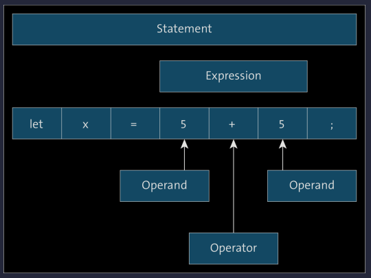
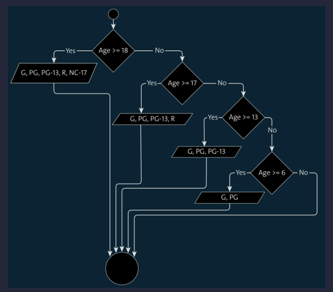
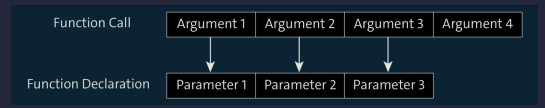
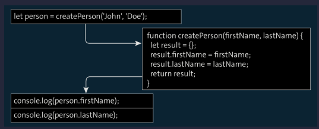
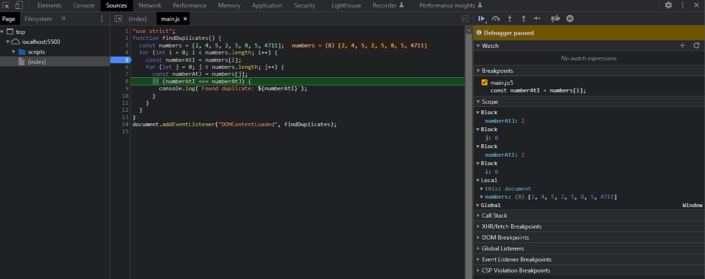

<h1>Language Core</h1>

To learn a programming language, you need to learn the syntax and grammar, just like when you learn a "real" language. The syntax determines the words that can be used in the given language, and the grammar defines the rules according to which these words can be arranged.

- [Storing Values in Variables](#storing-values-in-variables)
  - [Using Valid Variable Names](#using-valid-variable-names)
    - [Keywords](#keywords)
    - [Variable Names Already Assigned](#variable-names-already-assigned)
    - [Allowed Characters](#allowed-characters)
    - [Case Sensitivity](#case-sensitivity)
    - [CamelCase Spelling](#camelcase-spelling)
    - [Meaningful Names](#meaningful-names)
  - [Defining Constants](#defining-constants)
- [Using the Different Data Types](#using-the-different-data-types)
  - [Numbers](#numbers)
    - [Defining Numbers](#defining-numbers)
  - [Strings](#strings)
    - [Definition of Strings](#definition-of-strings)
    - [Escaping of Characters within Strings](#escaping-of-characters-within-strings)
    - [Using Template Strings](#using-template-strings)
    - [Defining Placeholders within Strings](#defining-placeholders-within-strings)
    - [Evaluating Expressions within Strings](#evaluating-expressions-within-strings)
    - [Defining Multiline Strings](#defining-multiline-strings)
  - [Boolean Values](#boolean-values)
  - [Arrays](#arrays)
    - [The Internal Structure of Arrays](#the-internal-structure-of-arrays)
    - [Multidimensional Arrays](#multidimensional-arrays)
  - [Objects](#objects)
    - [Definition of Objects](#definition-of-objects)
  - [Special Data Types](#special-data-types)
  - [Symbols](#symbols)
- [Deploying the Different Operators](#deploying-the-different-operators)
  - [Operators for Working with Numbers](#operators-for-working-with-numbers)
  - [Operators for Easier Assignment](#operators-for-easier-assignment)
  - [Operators for Working with Strings](#operators-for-working-with-strings)
  - [Operators for Working with Boolean Values](#operators-for-working-with-boolean-values)
    - [AND Operation](#and-operation)
    - [OR Operations](#or-operations)
    - [Negation Results](#negation-results)
  - [Boolean Operators for Non-Boolean Operands](#boolean-operators-for-non-boolean-operands)
  - [The Nullish Coalescing Operator](#the-nullish-coalescing-operator)
  - [Operators for Working with Bits](#operators-for-working-with-bits)
  - [Operators for Comparing Values](#operators-for-comparing-values)
  - [The Optional Chaining Operator](#the-optional-chaining-operator)
  - [The Logical Assignment Operators](#the-logical-assignment-operators)
  - [Operators for Special Operations](#operators-for-special-operations)
- [Controlling the Flow of a Program](#controlling-the-flow-of-a-program)
  - [Defining Conditional Statements](#defining-conditional-statements)
  - [Defining Branches](#defining-branches)
    - [Testing Multiple Conditions](#testing-multiple-conditions)
    - [Using More Complex Conditions](#using-more-complex-conditions)
    - [Nesting Branches](#nesting-branches)
  - [Using the Selection Operator](#using-the-selection-operator)
  - [Defining Multiway Branches](#defining-multiway-branches)
    - [Canceling switch Statements](#canceling-switch-statements)
  - [Defining Counting Loops](#defining-counting-loops)
    - [Counting Loop Structure](#counting-loop-structure)
    - [Nested Counting Loops](#nested-counting-loops)
  - [Defining Head-Controlled Loops](#defining-head-controlled-loops)
    - [Real-Life Example: Moving HTML Elements within a Web Page](#real-life-example-moving-html-elements-within-a-web-page)
  - [Defining Tail-Controlled Loops](#defining-tail-controlled-loops)
  - [Prematurely Terminating Loops and Loop Iterations](#prematurely-terminating-loops-and-loop-iterations)
    - [Prematurely Terminating Loops](#prematurely-terminating-loops)
    - [Prematurely Terminating Loop Iterations](#prematurely-terminating-loop-iterations)
    - [Infinite Loops](#infinite-loops)
    - [Defining Jump Labels](#defining-jump-labels)
- [Creating Reusable Code Blocks](#creating-reusable-code-blocks)
  - [Defining Functions Using a Function Declaration](#defining-functions-using-a-function-declaration)
  - [Defining Functions Using a Function Expression](#defining-functions-using-a-function-expression)
    - [Function Declarations versus Function Expressions](#function-declarations-versus-function-expressions)
  - [Calling Functions](#calling-functions)
  - [Defining Functions with a Parameter](#defining-functions-with-a-parameter)
    - [Calling Functions with a Parameter](#calling-functions-with-a-parameter)
    - [Defining Functions with Multiple Parameters](#defining-functions-with-multiple-parameters)
    - [Calling Functions with Multiple Parameters](#calling-functions-with-multiple-parameters)
    - [Calling Functions with Fewer Arguments than Specified Parameters](#calling-functions-with-fewer-arguments-than-specified-parameters)
    - [Calling Functions with More Arguments than Specified Parameters (Using the arguments Variable)](#calling-functions-with-more-arguments-than-specified-parameters-using-the-arguments-variable)
    - [Calling Functions with More Arguments than Specified Parameters (Using Rest Parameters)](#calling-functions-with-more-arguments-than-specified-parameters-using-rest-parameters)
    - [Functions with a Variable Number of Arguments](#functions-with-a-variable-number-of-arguments)
    - [Defining Functions within Functions](#defining-functions-within-functions)
  - [Defining Return Values](#defining-return-values)
  - [Defining Default Values for Parameters](#defining-default-values-for-parameters)
  - [Using Elements from an Array as Parameters](#using-elements-from-an-array-as-parameters)
  - [Defining Functions Using Short Notation](#defining-functions-using-short-notation)
  - [Modifying Strings via Functions](#modifying-strings-via-functions)
  - [unctions in Detail](#unctions-in-detail)
    - [The Function Call Stack](#the-function-call-stack)
    - [Execution Contexts](#execution-contexts)
    - [Scopes](#scopes)
    - [Scope Chain](#scope-chain)
    - [Context Object](#context-object)
  - [Calling Functions through User Interaction](#calling-functions-through-user-interaction)
- [Responding to Errors and Handling Them Correctly](#responding-to-errors-and-handling-them-correctly)
  - [Syntax Errors](#syntax-errors)
  - [Runtime Errors](#runtime-errors)
  - [Logic Errors](#logic-errors)
  - [The Principle of Error Handling](#the-principle-of-error-handling)
  - [Catching and Handling Errors](#catching-and-handling-errors)
  - [Triggering Errors](#triggering-errors)
  - [Errors and the Function Call Stack](#errors-and-the-function-call-stack)
  - [Calling Certain Statements Regardless of Errors That Have Occurred](#calling-certain-statements-regardless-of-errors-that-have-occurred)
- [Commenting the Source Code](#commenting-the-source-code)
- [Debugging the Code](#debugging-the-code)
  - [A Simple Code Example](#a-simple-code-example)
  - [Defining Breakpoints](#defining-breakpoints)
  - [Viewing Variable Assignments](#viewing-variable-assignments)
  - [Running a Program Step by Step](#running-a-program-step-by-step)
  - [Defining Multiple Breakpoints](#defining-multiple-breakpoints)
  - [Other Types of Breakpoints](#other-types-of-breakpoints)
  - [Viewing the Function Call Stack](#viewing-the-function-call-stack)

## Storing Values in Variables

To solve a problem with an algorithm, it is in most cases necessary to store certain information temporarily. This is done via variables. These are nothing more than mutable (variable) caches where you store values to access them at a later time. To be able to use variables, you need to perform two steps. First, you need to create the variable. This process is generally referred to as variable declaration. To declare a variable in JavaScript, you can use the `var` keyword, followed by the variable name

```JavaScript
var firstName;
var lastName;
```

As an alternative, it’s possible since ES2015 to use the `let` keyword for defining variables, which is the recommended method

```JavaScript
let firstName;
let lastName;
```

> JavaScript has many quirks and features, some of which lead to errors that are hard to find within an application. To prevent this, strict mode was introduced with ES5. This mode ensures that these potentially error-prone features cannot be used within a script. So strict mode ultimately leads to the use of a somewhat "cleaned up" version of JavaScript. You can activate strict mode either for the entire script or specifically for individual functions. In the first case, you include the statement `'use strict'`; at the beginning of the script; in the second case, you include it in the first line of the corresponding functions
>
> ```JavaScript
> "use strict"
> let firstName;
> let lastName;
> ```

After declaring a variable, you can assign an actual value to it. This is also referred to as value assignment or variable initialization.

```JavaScript
firstName = "John";
lastName = "Doe";
```

By using the equals sign, you assign a concrete value to a variable. In JavaScript, the equals sign is the assignment operator. It doesn’t represent two expressions that are equal in value as you would expect from the field of mathematics. The two steps of variable declaration and variable initialization can be conveniently combined into a single statement.

```JavaScript
let firstName = "John";
let lastName = "Doe";
```

In addition, you have the possibility to declare and initialize several variables within a single statement:

```JavaScript
let firstName='John', lastName='Doe';
```

In practice, however, the individual variables are often distributed over several lines for better readability. A best practice for declaring variables is as follows: use `let` for declaring variables for which the value can change at runtime (counter variables are a classic example). For all "variables" for which the value doesn’t change, use `const` instead. Keywords represent an important part of the syntax of a programming language and, in the case of JavaScript, ensure that the interpreter knows what to do. In the case of `var`, `let`, and `const`, the interpreter knows that a variable is to be created and that the appropriate amount of space must be reserved for it.

```JavaScript
let x = 4711;
console.log(x);  // Output: 4711
x = 5;
console.log(x);  // Output: 5
```

### Using Valid Variable Names

You are relatively free in the choice of names for variables, but there are a few restrictions that you must observe.

#### Keywords

There are other keywords in JavaScript that you can use to define certain things. Although not all of them are functional in the current version of JavaScript—but they are reserved for later versions of the language—you still must not use any of these keywords as variables.

| Keyword      | Description                                                                         |
| ------------ | ----------------------------------------------------------------------------------- |
| `async`      | Used to indicate asynchronous functions                                             |
| `await`      | Used to wait for the result of asynchronous functions                               |
| `break`      | Used to cancel multiway branches and loops                                          |
| `case`       | Used to define individual program branches in a multiway branch                     |
| `class`      | Used to define classes                                                              |
| `catch`      | Used to intercept errors                                                            |
| `const`      | Used to define constants                                                            |
| `continue`   | Used to cancel loop iterations                                                      |
| `debugger`   | Used to define breakpoints in the program                                           |
| `default`    | Used to define a standard program branch for multiway branches                      |
| `delete`     | Used to delete object properties                                                    |
| `do`         | Used to define tail-controlled loops                                                |
| `else`       | Used to define an alternative program branch when branching                         |
| `enum`       | Reserved keyword; no function assigned yet                                          |
| `export`     | Used in connection with modules                                                     |
| `extends`    | Used to define subclasses or superclasses                                           |
| `finally`    | Used to define default behavior when handling errors                                |
| `for`        | Used to define counting loops                                                       |
| `function`   | Used to define functions                                                            |
| `if`         | Used to define conditional statements and branches                                  |
| `implements` | Reserved keyword                                                                    |
| `import`     | Used in connection with modules                                                     |
| `in`         | Checks whether an object contains a property or a method                            |
| `interface`  | Reserved keyword                                                                    |
| `instanceof` | Checks whether an object is an instance of a prototype                              |
| `let`        | Used to define variables                                                            |
| `new`        | Used to create object instances                                                     |
| `package`    | Reserved keyword; no function assigned yet                                          |
| `private`    | Reserved keyword; no function assigned yet                                          |
| `protected`  | Reserved keyword; no function assigned yet                                          |
| `public`     | Reserved keyword; no function assigned yet                                          |
| `return`     | Used to define a return value of a function                                         |
| `static`     | Used to define static properties and methods                                        |
| `super`      | Used to access the superclass from a (sub)class                                     |
| `switch`     | Used to define multiway branches                                                    |
| `this`       | Used to access an object within the object itself                                   |
| `throw`      | Used to throw an error                                                              |
| `try`        | Used to define a code block in which errors can occur                               |
| `typeof`     | Determines the type of a variable                                                   |
| `var`        | Used to define variables                                                            |
| `void`       | Reserved keyword; no function assigned yet                                          |
| `while`      | Used to define head-controlled loops                                                |
| `with`       | Reserved keyword; should not be used and is not allowed in strict mode, for example |
| `yield`      | Used for generator functions                                                        |

#### Variable Names Already Assigned

While you cannot use keywords as variable names for syntactical reasons, there are also names that you could use but should not. We’re referring to names that are already assigned to existing global standard variables. The relevant standard variables essentially depend on the runtime environment: browsers define global standard variables that are different from those defined by a server-side runtime like Node.js. While browsers have predefined variables like `alert`, `document`, or `window`, Node.js has predefined variables such as `process`, `module`, and `exports`. The subsequent attempt to call the `log()` method on the console object fails.

```JavaScript
const number = 22;     // Define variable
console.log(number);   // Output: 22
const console = 4711;  // Define variable
console.log(number);   // TypeError: console.log is not a function
```

If you use one of these words as a variable name, you should at least be aware of the side effects this may have. In the previous example, it is obvious and the error is easy to find. A detailed listing of predefined variables can be found on the internet- [here for example](https://developer.mozilla.org/en-US/docs/Web/JavaScript/Reference/Global_Objects). [Here](https://nodejs.org/api/globals.html) for an overview of the global objects under Node.js.

#### Allowed Characters

Regardless of keywords and predefined variable names, you may use only certain characters within variable names, including letters and numbers, and you can't start a variable name with a number. For full details on the characters allowed, see [here for ECMAScript 5](https://mathiasbynens.be/notes/javascript-identifiers) and [here for ECMAScript 2015](https://mathiasbynens.be/notes/javascript-identifiers-es6). But for starters, it’s sufficient to follow these rules:

- A variable name may only start with a letter, the dollar sign ($), or an underscore (\_).
- A variable name must not start with a number.
- A variable name may contain letters, numbers, dollar signs, and underscores, but no other characters, like periods or hyphens.

```javascript
const 2ndName = 'James';   // invalid because it starts with a number
const first%Name = 'John'; // invalid because it contains special characters
const first-name = 'John'; // invalid because it contains a hyphen
const first_name = 'John'; // valid
const _firstName = 'John'; // valid
const $firstName = 'John'; // valid
```

#### Case Sensitivity

You should also note that variable names are case-sensitive.

```javascript
const name = "John"; // This is a different variable ...
const Name = "James"; // ... from this variable ...
const nAme = "Peter"; // ... and this variable.
```

#### CamelCase Spelling

You can use both uppercase and lowercase letters when assigning variable names. The only important thing is that you do it consistently. A generally accepted notation, for example, is the lowerCamelCase notation, where the variable name starts with a lowercase letter and then, if the name is composed of several words, each of the other words starts with an uppercase letter.

```javascript
const defaultValue = 2345;
const firstName = "John";
const lastName = "Doe";
const isAdmin = true;
const userIsNotLoggedIn = true;
```

#### Meaningful Names

Last but not least, we advise you to choose variables names that are as meaningful as possible so that you can tell the purpose of the variable from the name alone

```javascript
// not very meaningful variable names
const fn = "John ";
const ln = "Doe ";
// meaningful variable names
const firstName = "John ";
const lastName = "Doe ";
```

### Defining Constants

You have learned that you can change the value of variables any time; you can overwrite variables with a new value. Sometimes, however, you want to prevent this; that is, you actually need something like a variable, the value of which cannot be overwritten. These variables are called constants in programming because they are not variable but constant: once assigned, the value of a constant remains the same.

```javascript
const MAXIMUM = 5000;
```

Here, you can also see a common convention for naming constants: as a rule, these are written completely in uppercase. If the name consists of several words, separate them with an underscore. If you try to overwrite a constant, it depends on the runtime environment whether the corresponding statement is silently ignored or an error is thrown.

```javascript
const MAXIMUM = 5000;
MAXIMUM = 4711; // potential runtime error
console.log(MAXIMUM); // Output: 5000
```

## Using the Different Data Types

In total, JavaScript distinguishes among six different data types: on the one hand, there are the three primitive data types for representing numbers, strings, and Boolean values; on the other hand, there are the special data types `null` and `undefined` (also forms of primitive data types), plus the `Object` type, which serves as the basis for creating your own (complex) objects. In addition, we’ll introduce so-called arrays in this section. Strictly speaking, these are not a separate data type in JavaScript, but they are so essential and important for programming. Unlike other programming languages, such as Java, JavaScript does not require you to specify a data type in the variable declaration because it is determined dynamically at runtime based on the value assigned to the variable. Because the data type is not explicitly specified when declaring a variable in JavaScript, this is also referred to as loose typing. Other programming languages, such as Java, on the other hand, use what is known as strong typing or strict typing; that is, the data type must be explicitly defined in the variable declaration. If programmed carelessly, loose typing as in JavaScript can lead to unexpected problems, such as whenever you work with two or more variables of different data types. In addition, loose typing in JavaScript makes it possible to change the type of a variable during runtime—another potential source of errors.

### Numbers

As you would expect, numbers (or more precisely, numeric data) are used in programming to perform calculations, describe quantities, define ranges of values, or simply to count—for example, to calculate the total of all items in a shopping cart, to count how often a user has accessed a web page, or to specify how fast an animation should play on a web page.

#### Defining Numbers

In JavaScript, numbers are represented by a numeric value. Decimals, or floating point numbers, are noted with a dot. In addition, negative values can also be defined by simply prefixing the respective number with a minus sign. Since ES2021, it’s also possible to use underscores as separators within numbers. Especially with longer numbers, these separators can noticeably increase readability. In fact, readability is also the main reason for this feature: the numbers are still represented internally as if they had been created without separators

```javascript
const number1 = 5; // definition of an integer
const number2 = 0.5; // definition of a decimal
const number3 = -22; // definition of a negative integer
const number4 = -0.9; // definition of a negative decimal
const number5 = 12_300; // separator for decimal representation
const number6 = 1_000_000; // separator for decimal representation

console.log(number1); // 5
console.log(number2); // 0.5
console.log(number3); // -22
console.log(number4); // -0.9
console.log(number5); // 12300
console.log(number6); // 1000000
```

Integers can be defined in JavaScript using different number systems. The spelling is different in each case. In addition to the decimal notation (i.e., the base 10 number system), binary notation can be used for defining binary numbers (base 2 number system), the octal notation for defining octal numbers (base 8 number system), and the hexadecimal notation for defining hexadecimal numbers (base 16 number system). Binary numbers have the prefix `0b` followed by a sequence of zeros and ones

```javascript
const number1 = 0b01010101; // definition of a binary number (decimal value of 85)
// const number2 = 0b01010102;         // invalid binary number
const number3 = 0b1010_0011_1010_0101; // separator for binary representation

console.log(number1); // 85
console.log(number3); // 41893
```

[Octal](https://en.wikipedia.org/wiki/Octal) numbers always start with a `0` followed by a sequence of numbers between `0` and `7`. If one of the digits is outside the value range from 0 to 7, the leading 0 is ignored and the number is interpreted as a decimal number instead.

```javascript
const number1 = 050; // definition of an octal number (decimal value of 40)
// const number2 = 078; // invalid octal number (value of 78)
const number3 = 011147; // definition of an octal number (decimal value of 4711)

console.log(number1); // 40
console.log(number3); // 4711
```

[Hexadecimal](https://en.wikipedia.org/wiki/Hexadecimal) numbers always start with the string `0x`, followed by a sequence of hexadecimal values: the digits `0` to `9` and the letters `A` to `F` or `a` to `f`

```javascript
const number1 = 0xf; // definition of a hexadecimal number (decimal value of 15)
const number2 = 0xb; // definition of a hexadecimal number (decimal value of 11)
// const number3 = 0xG;     // invalid hexadecimal number (syntax error)
const number4 = 0xaf_bc_c0; // separator for hexadecimal representation

console.log(number1); // 15
console.log(number2); // 11
console.log(number4); // 11517120
```

The value range of numbers is limited in JavaScript; that is, you cannot define infinitely large or infinitely small numbers—and after all, your computer doesn’t have infinite memory either. The smallest possible number—that is, the minimum value of numbers that can be used—is stored in the `Number.MIN_VALUE` variable. The largest possible number—that is, the maximum value of numbers—is stored in the `Number.MAX_VALUE` variable. In most runtime environments, the former has the value `5e-324`, the latter the value `1.7976931348623157e+308` Therefore, if a calculation has an (actual) result outside this value range, the value `-Infinity` (for a value below the value range) or `Infinity` (for a value above the value range) is used instead.

```javascript
console.log(Number.MIN_VALUE); // Output: 5e-324
console.log(Number.MAX_VALUE); // Output: 1.7976931348623157e+308
console.log(Number.NEGATIVE_INFINITY); // Output: -Infinity
console.log(Number.POSITIVE_INFINITY); // Output: Infinity
```

Calculations that do not yield a valid numeric value return the special value `NaN` (an abbreviation for not a number).

### Strings

In programming, strings are sequences of characters—for example, letters, digits, special characters, and control characters. You use strings whenever you are dealing with any form of text.

#### Definition of Strings

The beginning and the end of a string are defined by quotation marks. You can use both single and double quotation marks.

```javascript
const firstName = 'John';        // single quotes
const lastName = "Doe";          // double quotes
const age = "22";                // not a number, but a string
const street = 'Sample Street";  // syntax error: mixed form
```

#### Escaping of Characters within Strings

If you want to use quotation marks within a string, you have several options, depending on the type of quotation marks you want to use within the string and on the type of quotation marks you use to define the string. If you use single quotes to define the string, you can easily use double quotes within the string. Similarly, you can use single quotes inside a string defined by double quotes. You can use the backslash character (`\`). If you add this character directly before the quotation mark, the interpreter does not interpret the quote as the end of the string but displays it as the character itself. The technical term for this prepending with the backslash character is escaping (the backslash character is also called an escape character). In other words, you escape the corresponding quotation mark for the interpreter so that it ignores it when determining the end of the string. In addition to single and double quotes (regardless of what kind of quotes you use to define a string), you also need to escape other characters: the control characters, which are characters that cannot be represented as such—for example, line breaks, indentations, and so on.

| Characters | Meaning                   |
| ---------- | ------------------------- |
| `\n`       | New line                  |
| `\t`       | Tab character/indentation |
| `\b`       | Backspace                 |
| `\r`       | Carriage return           |
| `\f`       | Form feed                 |

```javascript
const message = "Hello\nMr.\nDoe";
console.log(message);
/*
Hello
Mr.
Doe
*/
```

#### Using Template Strings

In everyday work with strings, you’ll often want to insert calculated values or values stored in variables at certain positions within a string. As a rule, string concatenation is then used to assemble the individual parts into a string

```javascript
const name = "John Doe";
const age = 44;
const message = "My name is " + name + ", I am " + age + " years old.";
console.log(message); // "My name is John Doe, I am 44 years old."
```

But this quickly becomes confusing when many variable parts are to be incorporated into a string. Moreover, this approach is not really advisable for performance reasons either. This is exactly the point where template strings come into play. You can think of template strings as an extended form of normal strings. Instead of being defined by single or double quotes as in normal strings, they are defined by ` characters (called backticks),

```javascript
const message = `Hello world.`;
console.log(message); // Hello world
```

#### Defining Placeholders within Strings

Within template strings, you can define placeholders using the `${}` notation

```javascript
const name = "John Doe";
const age = 44;
const message = `My name is ${name}, I am ${age} years old.`;
console.log(message); // My name is John Doe, I am 44 years old.
```

#### Evaluating Expressions within Strings

Besides variable names, you can use any other expressions inside the curly braces.

```javascript
const name = "John Doe";
const age = 44;
function getName() {
  return name;
}
const message = `My name is ${getName()}, I am twice the age of ${age / 2}.`;
console.log(message); // "My name is John Doe, I am twice the age of 22."
```

#### Defining Multiline Strings

Especially if you are dealing with long strings, in practice you will probably often split these strings into several parts and then distribute them over several lines connected by the + operator. Line breaks that are to be included in the string output must be coded with \n as usual.

```javascript
const message =
  "Dear Mr. Doe, \n\nWe are happy to return " +
  "the requested documents to you for review. \n\n" +
  "Yours sincerely, \nMrs. Smith, \nSample Company";
console.log(message);
// Output:
//
// Dear Mr. Doe,
//
// We are happy to return the requested documents to you for review.
//
// Yours sincerely,
// Mrs. Smith,
// Sample Company
```

Thanks to template strings, this misuse of the + operator is no longer necessary because line breaks are acceptable within template strings and are also considered as such when the string is output. In addition to the omission of + operators and the like, it’s also noticeable that the line breaks defined in the template string are also transferred to the output. In other words, you can also dispense with `\n` as encoding for a line break.

```javascript
const message = `Dear Mr. Doe,

we are happy to return the requested documents to you for review.

Yours sincerely,
Mrs. Smith,
Sample Company`;
console.log(message);
// Output:
//
// Dear Mr. Doe,
//
// We are happy to return the requested documents to you for review.
//
// Yours sincerely,
// Mrs. Smith,
// Sample Company
```

### Boolean Values

oolean values or Booleans are relatively easy to handle compared to numeric values and strings. This is because they can only take one of two values: `true` and `false`.

```javascript
const isLoggedIn = true;
const isAdmin = false;
```

### Arrays

The variables you’ve gotten to know so far each only contain a single value: a single number or a single string or a single Boolean value. You should now also know which of these data types to use in which case. In order to represent the user's shopping cart, for example, which is in its simplest form a list of item names, you won't get far with the primitive data types alone because then you would need to define a separate variable for each entry in the shopping cart. This process would be more than unwieldy for several reasons: For one thing, you would have to provide for a certain number of variables from the outset, which in turn would mean that a user could not add more than the intended number of products to the shopping cart. Second, things like sorting products by name would also be disproportionately time-consuming, as you would have to manually compare each variable with every other variable. This is exactly where arrays come into play. Arrays are nothing but lists; that is, arrays can contain not only one but several values. The most common and easiest way to create an array in JavaScript is the array literal notation. Here, you simply use the two square brackets (`[]`) to define the beginning and the end of the array. The individual entries (or values or elements) to be included in the array are written between these two brackets, separated by commas.

```javascript
const shoppingCart = [
  // start of array definition
  "Record player", // first entry
  "Loudspeaker", // second entry
  "Preamplifier", // third entry
  "Loudspeaker cables", // fourth entry
];
```

n contrast to other programming, languages like Java, arrays can also contain entries of different types. In other words, one array can contain numbers as well as strings or Boolean values, objects, and even other arrays. This is possible in JavaScript due to loose typing. In addition, arrays grow dynamically, which means that when you create an array, you do not need to know or specify how many elements should be contained therein.

```javascript
const values = [
  // an array ...
  "John Doe", // ... with a string ...
  22, // ... a number ...
  true, // ... and a Boolean
];
```

#### The Internal Structure of Arrays

Arrays, in fact, have what is called an index-based structure, which means that every element in an array is stored at a particular index (you could also say at a particular position). The counting of these indexes starts at 0—as is quite common in computer science, by the way: the first element in the array is at index 0, the second element is at index 1, and so on until the last element is at index `n-1`, where n is the length of the array.

| Index | Element              |
| ----- | -------------------- |
| 0     | "Record player"      |
| 1     | "Loudspeaker"        |
| 3     | "Preamplifier"       |
| 4     | "Loudspeaker cables" |

The index-based structure is relevant for you during the development phase in that you can use the indexes to specifically access the individual elements of an array. To do this, simply write the index of the element you want to access in square brackets after the name of the respective array.

```javascript
const item1 = shoppingCart[0]; // first entry
const item2 = shoppingCart[1]; // second entry
const item3 = shoppingCart[2]; // third entry
const item4 = shoppingCart[3]; // fourth entry
console.log(item1); // 'Record player'
console.log(item2); // 'Loudspeaker'
console.log(item3); // 'Preamplifier'
console.log(item4); // 'Loudspeaker cables'
```

#### Multidimensional Arrays

It’s also possible to add other arrays to an array. This enables you to create multidimensional arrays (i.e., arrays of arrays). They can be useful whenever you want to store different records of the same data in an array, similar to an Excel spreadsheet (this is one example of a two-dimensional array).

```javascript
const shoppingCart = [
  // start of outer array
  [
    // first entry
    "Record player", // first element in the first array
    200, // second element in the first array
    1, // third element in the first array
  ],
  [
    // second entry
    "Loudspeaker", // first element in the second array
    400, // second element in the second array
    2, // third element in the second array
  ],
  [
    // third entry
    "Preamplifier", // first element in the third array
    80, // second element in the third array
    1, // third element in the third array
  ],
  [
    // fourth entry
    "Loudspeaker cables", // first element in the fourth array
    20, // second element in the fourth array
    2, // third element in the fourth array
  ],
]; // end of outer array
```


Like with one-dimensional arrays, the individual values in a multidimensional array can be accessed via the index. However, depending on which array in which dimension you want to access, you will need to provide more details.

```javascript
console.log(shoppingCart[0][0]); // Output: Record player
console.log(shoppingCart[0][1]); // Output: 200
console.log(shoppingCart[0][2]); // Output: 1
console.log(shoppingCart[1][0]); // Output: Loudspeaker
console.log(shoppingCart[1][1]); // Output: 400
console.log(shoppingCart[1][2]); // Output: 2
console.log(shoppingCart[2][0]); // Output: Preamplifier
console.log(shoppingCart[2][1]); // Output: 80
console.log(shoppingCart[2][2]); // Output: 1
console.log(shoppingCart[3][0]); // Output: Loudspeaker cables
console.log(shoppingCart[3][1]); // Output: 20
console.log(shoppingCart[3][2]); // Output: 2
```

### Objects

Naturally, you can store all the data your program needs in numerous variables. At some point, you will have dozens, hundreds, or thousands of different variables and can't see the forest for the trees (not to mention the potential naming conflicts). It is better—and common practice in object-oriented programming—to combine related variables and functions in objects. This approach also creates clarity and increases the reusability of your source text. In the context of objects, variables are called properties (object properties) or attributes, and functions are referred to as methods (object methods). Properties provide information about the object they are contained in. Object methods represent certain tasks related to the object in which they are defined.

#### Definition of Objects

The easiest way to create objects in JavaScript is to use object literal notation. You simply define the object using braces and list the object properties and object methods within these braces, separated by commas.

```javascript
const item = {
  name: "JavaScript: The Comprehensive Guide",
  price: 55.95,
  author: "Philip Ackermann",
  isbn: "978-1-4932-2286-5",
  printDescription: function () {
    console.log(`${this.author}: ${this.name}`);
  },
};
```

The object in the example contains the four properties `name`, `price`, `author`, and `isbn`, as well as the `printDescription()` method. However, objects are actually key-value pairs, so you could also refer to `name`, `price`, `author`, `isbn`, and `printDescription` as keys. The key and value are separated from each other by a colon.

| Key                | Value                                   |
| ------------------ | --------------------------------------- |
| `name`             | `"JavaScript: The Comprehensive Guide"` |
| `price`            | `55.59`                                 |
| `author`           | `"Philip Ackermann"`                    |
| `isbn`             | `"978-1-4932-2286-5"`                   |
| `printDescription` | `[[Function}]`                          |

If you take a closer look at the above listing, you will notice the `this` keyword. This keyword is used to address the current object ("this" object). For example, `this.author` simply enables you to access the object's author property.

### Special Data Types

In addition to the data types discussed so far, there are two more special data types in JavaScript that are often confused in practice and/or used for the same thing. Both data types have one thing in common: they each have only a single value, which is also reflected by the names of these data types: `null` and `undefined`. If you declare a variable but do not initialize it yet (by assigning a value to it), it has the value `undefined`

```javascript
let name;
console.log(name); // Output: undefined
name = "John Doe";
console.log(name); // Output: John Doe
```

The `null` data type, however, represents an empty object.

```javascript
const dog = {
  name: "Bello",
};
const person = {
  firstName: "John",
  lastName: "Doe",
  pet: dog,
};
console.log(person.pet); // Output: Object {name: "Bello"}
person.pet = null;
console.log(person.pet); // Output: null
```


The `undefined` value is not meant to be manually assigned to a variable, but the `null` value is. The `undefined` value indicates that a variable has not yet been initialized; the `null` value represents an empty object pointer.

### Symbols

Symbols are another kind of primitive data type introduced with ES2015; they enable you to define unique and immutable values. Symbols can be created using the `Symbol()` function, optionally passing a symbol description as a parameter.

```javascript
const symbol1 = Symbol();
const symbol2 = Symbol("exampleDescription");
const symbol3 = Symbol();
const symbol4 = Symbol("exampleDescription");
console.log(symbol1); // Output: Symbol()
console.log(symbol2); // Output: Symbol(exampleDescription)
console.log(symbol3); // Output: Symbol()
console.log(symbol4); // Output: Symbol(exampleDescription)
console.log(symbol1 === symbol3); // Output: false
console.log(symbol2 === symbol4); // Output: false
```

You’ll notice that regardless of whether you create a symbol with or without a description, and regardless of whether the descriptions of two symbols are the same, two symbols are always different from each other. Therefore, a comparison of two symbols will result in the value false, as shown in the listing.

## Deploying the Different Operators

From mathematics, you may remember the term expression. A mathematical formula, like 5 _ 17, consists of operands and operators. In the example, 5 and 17 are the operands and _ is the operator. Unlike statements, expressions always have a result that is returned by the expression. In the 5 \* 17 example, the result is 85. This is relatively simple. In practice, expressions may well be more complex and contain multiple operands, different operators, function calls, and so on. As described earlier, a program consists of various statements to be executed sequentially by the interpreter. In JavaScript, each statement is terminated with a semicolon. This semicolon indicates to the JavaScript interpreter that a statement is complete. In addition, braces can be used to group statements into code blocks. Expressions, however, are combinations of operators and operands that together yield a value and can be part of a statement



In JavaScript (and also in other programming languages), both variables and simple values (literals) can be used as operands. Operators link the individual operands within an expression. A distinction is made between the following types of operators, depending on the number of operands:

- An operator that refers to a single operand is called a unary operator. An example of this is the increment operator `++` that can be used, for example, to directly increment counter variables by one: `counter++`.
- An operator that refers to two operands is called a binary operator. An example of this is the addition operator `+`, which can be used to sum up two numbers—for example, `x + y`.
- JavaScript even provides an operator that refers to three operands. This is the ternary operator

### Operators for Working with Numbers

JavaScript provides a set of arithmetic operators—that is, operators for working and calculating with numbers, including addition, subtraction, multiplication, division, and the remainder operator (modulo). In addition, there are the increment and decrement operators, which add 1 to a number (increment operator) or subtract 1 from a number (decrement operator), respectively. Since ES2016, the exponential operator is available, which can be used to calculate powers.

| Calculation Type  | Operator | Example           | Result of `x` |
| ----------------- | -------- | ----------------- | ------------- |
| Addition          | `+`      | `let x = 20 + 20` | `40`          |
| Subtraction       | `-`      | `let x = 20 - 5`  | `15`          |
| Multiplication    | `*`      | `let x = 20 * 5`  | `100`         |
| Division          | `/`      | `let x = 100 / 5` | `20`          |
| Modulo            | `%`      | `let x = 20 % 6`  | `2`           |
| Increment         | `++`     | `let x = 5; x++`  | `6`           |
| Decrement         | `--`     | `let x = 6; x--`  | `5`           |
| Power calculation | `**`     | `let x = 5**5`    | `3125`        |

There isn’t much more to say about arithmetic operators. The only thing you still need to know is the order in which the operators are evaluated, in case several arithmetic operators are used in an expression. All you have to remember is that multiplication and division are evaluated before addition and subtraction. Therefore, the expression `4 + 4 * 5` results in `24`, because `4 * 5` is evaluated first, and the first operand is added to this partial result (`4 + 20`) in a second step. However, if you want to evaluate the addition first and then the multiplication, you must enclose the operands of the addition in parentheses; for example, the result of `(4 + 4) * 5` is `40`.

### Operators for Easier Assignment

It often happens that you want to use a variable that already contains a number as an operand, and at the same time assign the result of the operation to the variable as a new value. The statement `result = result + 1` is such an example. The result variable is used on the one hand as an operand of the addition and on the other hand as a target variable for the addition result. As an alternative to this long notation, you can also use a short notation for the addition, subtraction, multiplication, division, and remainder operators, which combines both steps

```javascript
let result = 5;
result += 11; // the variable now has a value of 16 ...
result -= 1; // ... now a value of 15 ...
result /= 3; // ... now a value of 5 ...
result *= 4; // ... now a value of 20 ...
result %= 5; // ... and now a value of 0.
```

| Operator | Description                                                                                                                                       | Example         | Long Form               |
| -------- | ------------------------------------------------------------------------------------------------------------------------------------------------- | --------------- | ----------------------- |
| `+=`     | Adds the operand on the right to the value of the variable on the left and assigns the new value to the variable                                  | `result += 11`  | `result = result + 11`  |
| `-=`     | Subtracts the operand on the right from the value of the variable on the left and assigns the new value to the variable                           | `result -= 11`  | `result = result - 11`  |
| `*=`     | Multiplies the value of the variable on the left by the operand on the right and assigns the new value to the variable                            | `result *= 11`  | `result = result * 11`  |
| `/=`     | Divides the value of the variable on the left by the operand on the right and assigns the new value to the variable                               | `result /= 11`  | `result = result / 11`  |
| `%=`     | Calculates the remainder of the division of the variable value on the left and the operand on the right and assigns the new value to the variable | `result %= 11`  | `result = result % 11`  |
| `**=`    | Returns the result of raising the value on the left to the power of the operand on the right and assigns the new value to the variable            | `result **= 11` | `result = result ** 11` |

### Operators for Working with Strings

In JavaScript, the operator for joining two strings is the `+` operator. The joining itself is also called concatenation.

```javascript
const salutation = "Your personal newsletter,"; // string 1
const name = "John Doe"; // string 2
const message = salutation + name; // Your personal newsletter,John Doe
```

To insert a space after the comma, simply include it in the concatenation,

```javascript
const salutation = "Your personal newsletter,"; // string 1
const name = "John Doe"; // string 2
const message = salutation + " " + name; // Your personal newsletter, John Doe
```

Besides the + operator, the only other operator you can use with strings is the assignment operator `+=`. As usual, this is used to add the value on the right side of the operator to the variable on the left side, which in the case of strings means that the two strings are concatenated. Operators that can be used with different data types, such as the `+` operator and the `+=` operator, which work with both numbers and strings, are also referred to as overloaded. In the case of an overloaded operator, the operands’ data type determines exactly which operation is to be performed. With respect to the two operators mentioned previously, that is whether a concatenation (of strings) or an addition (of numbers) is to be performed.

### Operators for Working with Boolean Values

For working with Boolean values, there are various operators available in programming, which are referred to as logical operators.

| Operator | Meaning     |
| -------- | ----------- |
| `&&`     | Logical AND |
| `\|\|`   | Logical OR  |
| `!`      | Negation    |

The AND operator and OR operator are binary operators; that is, they expect two operands. The negation operator, on the other hand, is a unary operator; that is, it expects only a single operand. The result of all Boolean operations is a Boolean value. The AND operator returns `true` if both operands are `true`. Otherwise, it returns `false`. The OR operator returns `true` whenever one of the two operands is `true`. It only returns `false` if both operands are `false`. The negation operator negates a Boolean value. In other words, if the operand is `true`, the operator returns `false`; if the operand is `false`, the operator returns `true`.

```javascript
const isLoggedIn = true;
const isAdmin = false;
const isLoggedInAndAdmin = isLoggedIn && isAdmin; // AND operator
const isLoggedInOrAdmin = isLoggedIn || isAdmin; // OR operator
const isLoggedOut = !isLoggedIn; // negation
console.log(isLoggedInAndAdmin); // false
console.log(isLoggedInOrAdmin); // true
console.log(isLoggedOut); // false
```

#### AND Operation

| Operand 1 | Operand 2 | Result  |
| --------- | --------- | ------- |
| `true`    | `true`    | `true`  |
| `true`    | `false`   | `false` |
| `false`   | `true`    | `false` |
| `false`   | `false`   | `false` |

#### OR Operations

| Operand 1 | Operand 2 | Result  |
| --------- | --------- | ------- |
| `true`    | `true`    | `true`  |
| `true`    | `false`   | `true`  |
| `false`   | `true`    | `true`  |
| `false`   | `false`   | `false` |

#### Negation Results

| Operand | Result  |
| ------- | ------- |
| `true`  | `false` |
| `false` | `true`  |

### Boolean Operators for Non-Boolean Operands

One thing that may seem a bit confusing at first is that Boolean operators can also be used with operands that are not Boolean values, such as numbers, strings, or objects. In such a case, the JavaScript interpreter works according to the special rules outlined ahead. The following applies to the logical AND operation:

- If the first operand evaluates to `false`, the first operand is returned. A value that evaluates to `false` is also called a falsy value. Examples are the number 0 or an empty string.
- In all other cases, the second operand is returned.

| Operand 1   | Operand 2   | Result      |
| ----------- | ----------- | ----------- |
| `Object`    | `x`         | `x`         |
| `true`      | `x`         | `x`         |
| `false`     | `x`         | `false`     |
| `x`         | `null`      | `null`      |
| `null`      | `x`         | `null`      |
| `x`         | `NaN`       | `NaN`       |
| `NaN`       | `x`         | `NaN`       |
| `x`         | `undefined` | `undefined` |
| `undefined` | `x`         | `undefined` |

```javascript
const john = {
  firstName: "John",
  lastName: "Doe",
};

const james = {
  firstName: "James",
  lastName: "Doe",
};

const isJohnAndJames = john && james;
console.log(isJohnAndJames);
// Output: Object {firstName: "James", lastName: "Doe"}

console.log(false && "John"); // Output: false
console.log("John" && null); // Output: null
console.log(null && "John"); // Output: null
```

The following applies to the logical OR operation:

- If the first operand evaluates to `true`, the first operand is returned.
- In all other cases, the second operand is returned.

| Operand 1   | Operand 2   | Result      |
| ----------- | ----------- | ----------- |
| `Object`    | `x`         | `Object`    |
| `false`     | `x`         | `x`         |
| `x`         | `null`      | `x`         |
| `null`      | `x`         | `x`         |
| `null`      | `null`      | `null`      |
| `x`         | `NaN`       | `x`         |
| `NaN`       | `x`         | `x`         |
| `NaN`       | `NaN`       | `NaN`       |
| `x`         | `undefined` | `x`         |
| `undefined` | `x`         | `x`         |
| `undefined` | `undefined` | `undefined` |

```javascript
const john = {
  firstName: "John",
  lastName: "Doe",
};

const james = {
  firstName: "James",
  lastName: "Doe",
};

const isJohnOrJames = john || james;
console.log(isJohnOrJames);
// Output: Object {firstName: "John", lastName: "Doe"}
console.log(false || "John"); // Output: John
console.log("John" || null); // Output: John
console.log(null || "John"); // Output: John
```

The following applies to negation:

- An empty string returns `true`; a nonempty string returns `false`.
- All numbers except `0` (including the special `Infinity` value) return `false`, but the - number `0` returns `true`.
- Objects return `false`.
- The special values `null`, `NaN`, and `undefined` all return `true`.

| Operand                                    | Result  |
| ------------------------------------------ | ------- |
| Empty string                               | `true`  |
| Nonempty string                            | `false` |
| Number 0                                   | `true`  |
| Number not equal to 0 (including Infinity) | `false` |
| Object                                     | `false` |
| `null`                                     | `true`  |
| `NaN`                                      | `true`  |
| `undefined`                                | `true`  |

```javascript
const name = "John Doe";
const emptyString = "";
console.log(!name); // Output: false
console.log(!emptyString); // Output: true
const amount = 0;
const age = 25;
console.log(!amount); // Output: true
console.log(!age); // Output: false
console.log(!john); // Output: false
console.log(!null); // Output: true
console.log(!NaN); // Output: true
console.log(!undefined); // Output: true
```

### The Nullish Coalescing Operator

Another logical operator introduced with ES2020 is the nullish coalescing operator, which consists of two consecutive question marks. This logical operator works similarly to the logical OR operator (`||`), but there is a subtle difference: the `??` operator returns the value of the right operand only if the left operand is `null` or `undefined`.

```javascript
const someNullValue = null;
const someUndefinedValue = undefined;
const someNumber = 0;
const someText = "";
const someBoolean = false;

// Left operand is null --> return right operand
const a = someNullValue ?? "Default value for null";
console.log(a);
// Output: Default value for null

// Left operand is undefined --> return right operand
const b = someUndefinedValue ?? "Default value for undefined";
console.log(b);
// Output: Default value for undefined

// Left operand is 0 ("falsy") --> return left operand
const c = someNumber ?? 80;
console.log(c);
// Output: 0

// Left operand is an empty string ("falsy") --> return left operand
const d = someText ?? "Default value for empty string";
console.log(d);
// Output: ''

// Left operand is false --> return left operand
const e = someBoolean ?? true;
console.log(e);
// Output: false

const x = 4711;

console.log({} ?? x); // {}
console.log(false ?? x); // false
console.log(x ?? null); // 4711
console.log(null ?? x); // 4711
console.log(null ?? null); // null
console.log(x ?? NaN); // 4711
console.log(NaN ?? x); // NaN
console.log(x ?? undefined); // 4711
console.log(undefined ?? x); // 4711
console.log(undefined ?? undefined); // undefined
```

| Operand 1   | Operand 2   | Result      |
| ----------- | ----------- | ----------- |
| `Object`    | `x`         | `Object`    |
| `false`     | `x`         | `false`     |
| `x`         | `null`      | `x`         |
| `null`      | `x`         | `x`         |
| `null`      | `null`      | `null`      |
| `x`         | `NaN`       | `x`         |
| `NaN`       | `x`         | `x`         |
| `NaN`       | `NaN`       | `NaN`       |
| `x`         | `undefined` | `x`         |
| `undefined` | `x`         | `x`         |
| `undefined` | `undefined` | `undefined` |

### Operators for Working with Bits

Bitwise operations enable you to work with single bits of values.

| Operator | Meaning                                                                                                                 |
| -------- | ----------------------------------------------------------------------------------------------------------------------- |
| `&`      | Bitwise AND                                                                                                             |
| `\|`     | Bitwise OR                                                                                                              |
| `^`      | Bitwise exclusive OR                                                                                                    |
| `~`      | Bitwise NOT, where the result for a number `x` is `-(x + 1)`. So for the number `65`, for example, the result is `-66`. |
| `<<`     | Bitwise left shift                                                                                                      |
| `>>`     | Bitwise right shift                                                                                                     |
| `>>>`    | Bitwise unsigned right shift                                                                                            |

```javascript
let BYTE_A = 0b00000001; // Binary value 00000001, decimal value 1
// Bitwise left shift
BYTE_A = BYTE_A << 1; // Binary value 00000010, decimal value 2
BYTE_A = BYTE_A << 1; // Binary value 00000100, decimal value 4
BYTE_A = BYTE_A << 1; // Binary value 00001000, decimal value 8
BYTE_A = BYTE_A << 1; // Binary value 00010000, decimal value 16
// bitwise right shift
BYTE_A = BYTE_A >> 1; // Binary value 00001000, decimal value 8
BYTE_A = BYTE_A >> 1; // Binary value 00000100, decimal value 4
BYTE_A = BYTE_A >> 1; // Binary value 00000010, decimal value 2
BYTE_A = BYTE_A >> 1; // Binary value 00000001, decimal value 1

let BYTE_B = 0b01000001; // Binary value 01000001, decimal value 65

// bitwise AND
let BYTE_C = BYTE_A & BYTE_B; // Binary value 00000001, decimal value 1

// bitwise OR
let BYTE_D = BYTE_A | BYTE_B; // Binary value 01000001, decimal value 65

// bitwise exclusive OR
let BYTE_E = BYTE_A ^ BYTE_B; // Binary value 01000000, decimal value 64
```

### Operators for Comparing Values

Comparing two values is certainly one of the most frequently performed tasks in programming, be it comparing strings, numbers, or Boolean values.

| Operator | Meaning                  | Description                                                                                                                                               |
| -------- | ------------------------ | --------------------------------------------------------------------------------------------------------------------------------------------------------- |
| `==`     | Equal                    | Compares two values and checks if they are the same.                                                                                                      |
| `!=`     | Unequal to               | Compares two values and checks if they are unequal.                                                                                                       |
| `===`    | Strictly equal to        | Compares not only two values, but also the data types of the values. Only if the values and the data types are the same does this operator return `true`. |
| `!==`    | Strictly unequal to      | Compares not only two values, but also the data types of the values. If the values or the data types are not equal, this operator returns `true`.         |
| `<`      | Less than                | Compares two values and checks if the left operand is smaller than the right operand.                                                                     |
| `>`      | Greater than             | Compares two values and checks if the left operand is greater than the right operand.                                                                     |
| `<=`     | Less than or equal to    | Compares two values and checks if the left operand is smaller than or equal to the right operand.                                                         |
| `>=`     | Greater than or equal to | Compares two values and checks if the left operand is greater than or equal to the right operand.                                                         |

The operators `==` and `!=` perform a nonstrict comparison of two values, whereas the operators `===` and `!==` perform a strict comparison of two values.

```javascript
console.log(false == 0); // Output: true
console.log(false == 1); // Output: false
console.log(true == 1); // Output: true
console.log(true == 0); // Output: false
console.log("4711" == 4711); // Output: true
console.log(false != 0); // Output: false
console.log(false != 1); // Output: true
console.log(true != 1); // Output: false
console.log(true != 0); // Output: true
console.log("4711" != 4711); // Output: false
```

The automatic conversion of a value into another data type is also called implicit type conversion.

```javascript
console.log(false === 0); // Output: false
console.log(false === 1); // Output: false
console.log(true === 1); // Output: false
console.log(true === 0); // Output: false
console.log("4711" === 4711); // Output: false
console.log(false !== 0); // Output: true
console.log(false !== 1); // Output: true
console.log(true !== 1); // Output: true
console.log(true !== 0); // Output: true
console.log("4711" !== 4711); // Output: true
```

It’s a best practice to always use the strict comparison operators for comparing two variables. This will prevent the automatic type conversion from taking effect, which can often lead to program errors that are hard to find.

### The Optional Chaining Operator

The process of accessing nested properties or methods of an object was relatively cumbersome in JavaScript for a long time: on the path to the desired property, you had to gradually check for all properties whether they were present in the hierarchy.

```javascript
const john = {
  firstName: "John",
  lastName: "Doe",
  contact: {
    email: "john.doe@javascripthandbuch.com",
  },
};

const james = {
  firstName: "James",
  lastName: "Doe",
};

if (john.contact && john.contact.email) {
  console.log(john.contact.email);
}
// Output: "john.doe@javascripthandbuch.com"

// Runtime error!
// console.log(james.contact.email);

if (james.contact && james.contact.email) {
  console.log(james.contact.email);
}
// No output
```

With ES2020, the optional chaining operator was fortunately included in the standard. This operator is placed directly after a property when it is accessed, which ensures that the next hierarchy level is only accessed if the corresponding property exists. If it does not, the access attempt is aborted.

```javascript
const john = {
  firstName: "John",
  lastName: "Doe",
  contact: {
    email: "john.doe@javascripthandbuch.com",
  },
};

const james = {
  firstName: "James",
  lastName: "Doe",
};

// Access to nested property via
// optional chaining operator:
console.log(john.contact?.email);
// Output: "john.doe@javascripthandbuch.com"

console.log(james.contact?.email);
// Output: undefined

// Alternative possibility: Using the
// operator on multiple hierarchy levels:
console.log(john?.contact?.email);
// Output: "john.doe@javascripthandbuch.com"

console.log(james?.contact?.email);
// Output: undefined
```

Conveniently, the optional chaining operator can be used not only for accessing properties, but also for accessing methods.

### The Logical Assignment Operators

Included in the standard with ES2021 are the logical assignment operators. This small group of operators combines logical operators and assignment expressions, making conditional value assignment easier for variables and object properties, among other things. The logical OR assignment operator `||=` is a combination of the logical `||` operator and the assignment operator `=`; that is, it assigns the right operand to the left operand if the former has a falsy value and is thus a short form of the notation `a || (a = b)`. The logical AND assignment operator `&&=` works similarly, but it combines the logical `&&` operator and the assignment operator `=` and assigns the right operand to the left operand only if the former has a truthy value (i.e., a value that evaluates to true). This means it is a short form of the notation `a && (a = b)`. The operator for the logical nullish assignment `??=` in turn is a short form of the notation `a ?? (a = b)`. It assigns the second operand to the first operand only if the former is null or undefined.

```javascript
// logical OR assignment
let a1 = 5;
let a2 = null;
let a3 = false;
a1 ||= 7; // --> 5
a2 ||= 7; // --> 7
a3 ||= 7; // --> 7
console.log(`a1: ${a1}`); // "a1: 5"
console.log(`a2: ${a2}`); // "a2: 7"
console.log(`a3: ${a3}`); // "a3: 7"

// logical AND assignment
let b1 = 5;
let b2 = null;
let b3 = false;
b1 &&= 7; // --> 7
b2 &&= 7; // --> null
b3 &&= 7; // --> false
console.log(`b1: ${b1}`); // "b1: 7"
console.log(`b2: ${b2}`); // "b2: null"
console.log(`b3: ${b3}`); // "b3: false"

// logical nullish assignment
let c1 = 5;
let c2 = null;
let c3 = false;
c1 ??= 7; // --> 5
c2 ??= 7; // --> 7
c3 ??= 7; // --> false
console.log(`c1: ${c1}`); // "c1: 5"
console.log(`c2: ${c2}`); // "c2: 7"
console.log(`c3: ${c3}`); // "c3: false"
```

The new logical assignment operators are especially useful for initializing object properties

```javascript
const james = {
  firstName: "James",
};
james.firstName ||= "John";
james.lastName ||= "Doe";
console.log(james);
// { firstName: 'James', lastName: 'Doe' }

// Prior to ES2021, the following was required:
const peter = {
  firstName: "Peter",
};
peter.firstName || (peter.firstName = "John");
peter.lastName || (peter.lastName = "Doe");
console.log(peter);
// { firstName: 'Peter', lastName: 'Doe' }
```

### Operators for Special Operations

In addition to the operators shown, there are a number of other operators in JavaScript,

| Operation                                                        | Operator                            | Description                                                                                                                                                                            |
| ---------------------------------------------------------------- | ----------------------------------- | -------------------------------------------------------------------------------------------------------------------------------------------------------------------------------------- |
| Conditional operator                                             | `<condition> ? <value1> : <value2>` | Ternary operator that, depending on a condition (first operand), returns one of two values (defined by the second and third operands).                                                 |
| Deleting objects, object properties, or elements within an array | `delete`                            | Enables you to delete elements from arrays as well as object properties from objects.                                                                                                  |
| Existence of a property in an object                             | `<property> in <object> `           | Checks whether an object has a property.                                                                                                                                               |
| Type verification                                                | `<object> instanceof <type>`        | Binary operator that checks whether an object is of a specific type.                                                                                                                   |
| Type determination                                               | `typeof <Operand>`                  | Determines the data type of the operand. The operand can be an object, a string, a variable, or a keyword like true or false. Optionally, the operand can be specified in parentheses. |

## Controlling the Flow of a Program

Suppose you want to display a specific message within a web page in case a user has already logged in, and not display this message if the user is not logged in. Or you want to dynamically generate a table on a web page from a list of data, but you don't know in advance how much data is contained in the list. For cases like these, programming languages have control structures that allow you to determine whether a block of statements should be executed and how often a use case should be executed. In programming, the former is handled via conditional statements or branches, the latter via loops or repetitions. Let's start with the first case, conditional statements.

### Defining Conditional Statements

Relatively often, you will want to execute certain statements within a program only if a certain condition is met. In programming, such conditional statements can be implemented using an if statement. The keyword `if` initiates the if statement, the following parentheses contain the condition, and the braces enclose the statement(s) to be executed if the condition is true or fulfilled.

```javascript
const userIsLoggedIn = true;
if (userIsLoggedIn) {
  const message = "Welcome, " + userName;
  document.getElementById("message").textContent = message;
}
```


The `userIsLoggedI`n variable doesn’t necessarily have to contain a Boolean value. If it contains another value, the `if` statement checks whether this value evaluates to `true`.

### Defining Branches

With a conditional statement, you test against a Boolean condition and execute the corresponding statement(s) if the condition is met. However, you will often want to execute another statement if the Boolean condition is not met. This case is not referred to as a conditional statement, but as branching. In this case, the code takes one of two paths: one path if the condition is met, the other path if the condition is not met. The code branches, so to speak. To define a branch, use the `if` statement as for a conditional statement, but add another program branch to this construct, which is initiated by the `else` keyword.

```javascript
const userIsLoggedIn = true;
if (userIsLoggedIn) {
  const message = "Welcome, " + userName;
  document.getElementById("message").textContent = message;
} else {
  displayLoginForm();
}
```


#### Testing Multiple Conditions

There are other cases in which you will not want only to take one of two paths in the program. Sometimes you may want to test several conditions and execute a certain part of the program depending on which of the conditions is met. That is, you also need a way to be able to take one of several program branches.

```javascript
const age = prompt("For what age are you looking for film tips?");
if (age >= 18) {
  console.log("Show films with a rating of G, PG, PG-13, R, and NC-17.");
} else if (age >= 17) {
  console.log("Show films with a rating of G, PG, PG-13, and R.");
} else if (age >= 13) {
  console.log("Show films with a rating of G, PG, and PG-13.");
} else if (age >= 6) {
  console.log("Show films with a rating of G and PG.");
}
```



As a rule in this regard, it is recommended to always query the more specific conditions first and the more general conditions last. The conditions to be checked for `if-else-if-else` statements must be defined from specific to general: specific conditions must be tested first, more general conditions last. Basically, however, you should not use an exceedingly high number of different `if-else `branches; otherwise the code tends to be not quite as readable.

#### Using More Complex Conditions

```javascript
const userIsLoggedIn = true;
const userIsAdmin = false;
if (userIsLoggedIn && userIsAdmin) {
  /* ... */
}
```

In practice, of course, much more complex conditions can be defined. There are no limits to your imagination. However, as is so often the case in programming, simply written code is also easier to understand for the developer.

#### Nesting Branches

The more complex a program becomes, the more you will need to test different conditions and provide for different program branches.

```javascript
const age = prompt("For what age are you looking for film tips?");
if (!isNaN(parseFloat(age)) && isFinite(age)) {
  if (age >= 18) {
    console.log("Show films with a rating of G, PG, PG-13, R, and NC-17.");
  } else if (age >= 17) {
    console.log("Show films with a rating of G, PG, PG-13, and R.");
  } else if (age >= 13) {
    console.log("Show films with a rating of G, PG, and PG-13.");
  } else if (age >= 6) {
    console.log("Show films with a rating of G and PG.");
  }
} else {
  console.error("Invalid age entered.");
}
```

In this example, a condition (`!isNaN(parseFloat(age)) && isFinite(age)`) is used to check whether the entered value is a number. Only if this condition is met is the part of the program that checks the concrete value of the age.

### Using the Selection Operator

In programming, you’ll often want to assign one value or another to a variable depending on a condition. Suppose you want to find out if a user is at least 18 based on the age entered and then store the result of this check in the variable `isAtLeast18`. You could achieve this using an `if-else` statement.

```javascript
const age = prompt("Please enter your age.");
let isAtLeast18;
if (age >= 18) {
  isAtLeast18 = true;
} else {
  isAtLeast18 = false;
}
console.log(isAtLeast18);
```

If you assign the variable an initial value right at the beginning, you can also omit the else part and only use a conditional statement

```javascript
const age = prompt("Please enter your age.");
let isAtLeast18 = false;
if (age >= 18) {
  isAtLeast18 = true;
}
console.log(isAtLeast18);
```

This is already shorter , but can be shortened further using the selection operator.

```javascript
const variable = condition ? value1 : value2;
```

So, for the time being, this is a very ordinary assignment: on the left side of the equals sign, you write the variable name, and on the right side you include the expression with the selection operator. This is a ternary operator as it has not one or two but three operands. The first operand is the condition to be checked, followed by a question mark. The second operand is the value to be assigned to the variable if the condition is met. And the third operand is the value to be assigned if the condition is not met. The two values are separated by a colon.

```javascript
const age = prompt("Please enter your age.");
const isAtLeast18 = age >= 18 ? true : false;
console.log(isAtLeast18);
```

Conditional statements and branches are used to take one of several paths in the program depending on one or more conditions and to execute the statements contained therein. The selection operator, on the other hand, is used to assign one of two values to a variable depending on a single condition. Also note that you should neither nest the selection operator nor use code blocks, both of which result in very complex and unreadable expressions.

### Defining Multiway Branches

There is an alternative to `if-else-if-else` statements, which is even the better choice in some use cases. We are talking about multiway branching, also called switch branching because of one of the keywords used. Basically, such switch statements are comparable to `if-else-if-else` branches, but their notation is somewhat clearer than a long sequence of `if-else-if-else` branches, especially when a variable to be checked can take several values.

```javascript
switch (expression) {
  case value1:
    // Statements
    break;
  case value2:
    // Statements
    break;
  case value3:
    // Statements
    break;
  case value4:
    // Statements
    break;
  default:
  // Statements
}
```

A switch statement is initiated by the keyword switch. This is followed by an expression in parentheses (in the listing: expression), the value of which will be used to control one of several program branches. The individual program branches are in turn defined by the keyword case. Within such a program branch, you can also use the keyword break to jump out of the entire switch statement and thus abort the respective program branch. Usually, you put a break at the end of every case program branch. But you can also omit it. To catch cases that are not caught by the case statements, you use the keyword default, which is roughly comparable to the terminating else of an if-else-if-else statement: if none of the previously defined case statements apply, the statements are executed in the default program branch.

```javascript
const testResultElement = document.getElementById("testResult");
const testResult = 0; // Test result, would normally be calculated
let icon = null; // Variable that will contain the image name
switch (
  testResult // Check the test result.
) {
  case 0: // If this has a value of 0, ...
    icon = "pass.png"; // ... the image name "pass.png" is used.
    break; // Abort the switch statement
  case 1: // If the test result has a value of 1, ...
    icon = "info.png"; // ... the image name "info.png" is used.
    break; // Abort the switch statement
  case 2: // If the test result has a value of 2, ...
    icon = "warning.png"; // ... the image name "warning.png" is used.
    break; // Abort the switch statement
  case 3: // If the test result has a value of 3, ...
    icon = "error.png"; // ... the image name "error.png" is used.
    break; // Abort the switch statement
  default: // For all other values ...
    icon = "unknown.png"; // ... the image name "unknown.png" is used.
}
```


#### Canceling switch Statements

We already mentioned that a `break` is usually written at the end of a case program branch, but haven’t explained why. The reason is simple: the keyword `break` prevents the statements of the following case expressions from being executed. If you omit `break`, this will ensure that all statements defined after an applicable case expression are executed. You can take advantage of this behavior and combine different case statements.

```javascript
const testResultElement = document.getElementById('testResult');
const testResult = 0;        // Test result, would normally be calculated
let icon = null;             // Variable that will contain the image name
switch(testResult) {         // Check the test result.
  case 0:                    // If this has a value of 0 ...
  case 1:                    // ... or a value of 1, ...
    icon = 'pass.png';       // ... the image name "pass.tif" is used.
    break;                   // Abort
  case 2:                    // If the test result has a value of 2, ...
  case 3:                    // ... or a value of 3, ...
    icon = 'error.png';      // ... the image name "error.tif" is used.
    break:                   // Abort
  default:                   // For all other values ...
    icon = 'unknown.png';    // ... the image name "unknown.tif" is used.
}
testResultElement.src = 'img/' + icon;
```

If you want to take one out of several paths in the program depending on Boolean conditions, you should use conditional statements or branches. Multiway branches via the switch statement, however, are generally not suitable for testing Boolean conditions.

### Defining Counting Loops

Conditional statements, branches, and multiway branches are therefore one important construct that enables you to program more complex processes within an application. But there is also a second essential programming construct, one for executing statements repeatedly. In programming, iteration is the repeated execution of statements. In programming, loops are the method of choice for such a repeated execution of program code. Overall, there are three different types of such loops, which are more or less suitable depending on the application. First there is the counting loop, which executes code repeatedly based on a counter variable. Then there are the head-controlled loop and the tail-controlled loop, both of which execute code for as long as a certain condition is met.

#### Counting Loop Structure

Counting loops are always suitable when you know in advance how often certain statements are to be repeated—for example, to list all items in a shopping cart. The whole thing is initiated by the keyword `for` (that's why the counting loop is often called a for loop). Inside the following pair of parentheses, you define three things:

- **Initialization** Here you write the code that should be executed once before executing the entire loop. As a rule, this is where you initialize the counter variable (examples to follow shortly).
- **Condition** This is where you put the code that—before executing a loop iteration—first checks whether or not to continue executing the loop. Typically, here you check whether the counter variable has already reached a certain limit (e.g., the length of an array).
- **Increment expression** Here you write the code that should be executed after each loop iteration. Normally, the counter variable is incremented here.

Initialization, condition, and increment expressions are separated by semicolons. This is important so that the JavaScript interpreter can determine what code belongs where.

```javascript
for (
  Initialization;         // is executed before the loop is executed
  Condition;              // is checked before executing an iteration
  Increment expression    // executed at the end of an iteration
) {
  Loop body               // is executed once in each iteration
}
```

Regarding the order, the following happens:

1. At the beginning of the loop, the initialization statement is executed once.
2. Then the condition is checked.
3. If it’s true, the loop body is executed.
4. And then the increment expression is evaluated.
5. Then the process continues by checking the condition, executing the loop body, and executing the increment expression, until the condition is no longer fulfilled.
6. At this point—that is, when the condition returns false—the loop execution is terminated.


```javascript
for (
  let i = 1; // Initialization: will be executed before the loop is executed
  i <= 10; // Condition: is checked before executing an iteration
  i++ // Increment expression: is executed at the end of an iteration
) {
  // Loop body: executed once in each iteration
  console.log(i);
}
// And here again in a notation suitable for everyday use:
for (let i = 1; i <= 10; i++) {
  console.log(i);
}
```

| Value of i before Checking the Condition | Condition | Execution of Loop Body                     | Output | Value of i after Increment Expression |
| ---------------------------------------- | --------- | ------------------------------------------ | ------ | ------------------------------------- |
| 1                                        | 1 <= 10   | Yes                                        | 1      | 2                                     |
| 2                                        | 2 <= 10   | Yes                                        | 2      | 3                                     |
| 3                                        | 3 <= 10   | Yes                                        | 3      | 4                                     |
| 4                                        | 4 <= 10   | Yes                                        | 4      | 5                                     |
| 5                                        | 5 <= 10   | Yes                                        | 5      | 6                                     |
| 6                                        | 6 <= 10   | Yes                                        | 6      | 7                                     |
| 7                                        | 7 <= 10   | Yes                                        | 7      | 8                                     |
| 8                                        | 8 <= 10   | Yes                                        | 8      | 9                                     |
| 9                                        | 9 <= 10   | Yes                                        | 9      | 10                                    |
| 10                                       | 10 <= 10  | Yes                                        | 10     | 11                                    |
| 11                                       | 11 <= 10  | No, because the condition is not fulfilled |        |                                       |

Of course, the name i by itself is not a meaningful variable name, but in the context of loops this name has become quite common for the counter variable. The letter i here is an abbreviation of index, which may be familiar in this form from mathematics—for example, from totals formulas.

#### Nested Counting Loops

There are no restrictions regarding the statements included in a loop body. For example, it’s possible to execute other loops within a loop body. Due to the nesting, this construction is then also called nested loops.

```javascript
// outer loop
for (let i = 1; i < 11; i++) {
  // inner loop
  for (let j = 1; j < 11; j++) {
    console.log(`i has the value "${i}", j has the value "${j}"`);
  }
}

/*
i has the value "1", j has the value "1"
i has the value "1", j has the value "2"
i has the value "1", j has the value "3"
i has the value "1", j has the value "4"
i has the value "1", j has the value "5"
i has the value "1", j has the value "6"
i has the value "1", j has the value "7"
i has the value "1", j has the value "8"
i has the value "1", j has the value "9"
i has the value "1", j has the value "10"
i has the value "2", j has the value "1"
i has the value "2", j has the value "2"
i has the value "2", j has the value "3"
i has the value "2", j has the value "4"
i has the value "2", j has the value "5"
...
i has the value "10", j has the value "6"
i has the value "10", j has the value "7"
i has the value "10", j has the value "8"
i has the value "10", j has the value "9"
i has the value "10", j has the value "10"
*/
```

A quite common requirement in practice is to output the data of a multidimensional array.

```javascript
const coordinates = [
  [50.69, 8.94],
  [54.29, 11.97],
  [55.38, 12.88],
  [60.78, 9.94],
  [62.29, 7.69],
  [70.34, 8.24],
  [72.59, 11.29],
  [80.69, 8.56],
];
for (let i = 0; i < coordinates.length; i++) {
  const coordinate = coordinates[i];
  for (let j = 0; j < coordinate.length; j++) {
    console.log(coordinate[j]);
  }
}
```

For nested loops, use a new counter variable for each loop. This will prevent the individual loops from getting in each other's way. It has become a convention to use the names i, j, k, l, and so on. Basically, you can nest loops as "deeply" as you like; that is, nested loops can again contain loops, and so on. In practice, however, it’s quite unusual to use more than three nesting levels as the code required can quickly become very confusing or difficult to understand.

### Defining Head-Controlled Loops

Both head-controlled and tail-controlled loops basically function in the same way: the purpose of both loops is to execute one or more statements repeatedly so long as a given Boolean condition is fulfilled. The difference between the two types of loops is the time at which the Boolean check takes place. The head-driven loop, also called a while loop, first checks whether the Boolean condition is met. If this is the case, the code in braces (the loop body) is executed. If, on the other hand, the condition is not or no longer fulfilled, the loop body is not (or no longer) executed, and the execution of the program continues after the loop

```javascript
while (expression) {
  // Statement(s)
}
```


Unlike the for loop, which consists of an initialization expression, the condition, and the increment expression, the while loop only contains an expression that is used to set the condition. If you want to emulate a counting loop using a while loop and output the numbers 1 to 10, for example, you must write the initialization expression before the loop and place the increment expression inside the loop body

```javascript
let i = 1; // Initialization
while (i < 11) {
  // Condition
  console.log(i); // Statement
  i++; // Increment
}
```

However, while loops are usually not used for such counter-oriented tasks.

#### Real-Life Example: Moving HTML Elements within a Web Page

Suppose you have two lists on a web page and want to move all the list entries from one list (the source list) over to the other list (the target list) at the push of a button. The corresponding algorithm would look like the following: while there is still a list entry in the source list, this entry should be removed from the source list and moved to the target list. The word while already indicates that the while loop is the right choice for the language construct.

```html
<ul id="source">
  <li>John Doe</li>
  <li>James Doe</li>
  <li>Peter Doe</li>
  <li>Jane Doe</li>
</ul>
<div>
  <button id="move">&gt;&gt;</button>
</div>
<ul id="target"></ul>
```

Although most browsers tolerate or interpret the greater-than sign (`>`) without a preceding less-than sign (`<`) as a normal character, this still isn’t valid HTML and should therefore be represented by the string `&gt;` as in the example.

```javascript
const sourceList = document.getElementById("source"); // the source list
const targetList = document.getElementById("target"); // the target list
const copyButton = document.getElementById("move"); // the Move ...
// ... button
copyButton.addEventListener("click", function () {
  // When clicking the ...
  // ... button:
  while (sourceList.hasChildNodes()) {
    // While there are items ...
    // ... in the source list, ...
    const item = sourceList.removeChild(
      // ... the first item is ...
      sourceList.firstChild
    ); // ... removed from this list ...
    targetList.appendChild(item); // ... and added to the ...
    // ... target list.
  }
});
```

### Defining Tail-Controlled Loops

Basically, the tail-controlled loop works similarly to the head-controlled loop, but in exactly the opposite way. In other words: before the Boolean condition is checked, the loop body is already executed once. The tail-controlled loop is also called a do-while loop because of the keywords used.

```javascript
do {
  // Statement(s)
} while (expression);
```


A while loop is executed 0 to n times, and a do-while loop is executed 1 to n times. In practice, you will probably use the while loop more often than the do-while loop as it ensures that the loop body is executed only when the corresponding condition is met. The do-while loop, on the other hand, should normally be used when the loop body (regardless of the condition) is to be executed at least once. Like counting loops, head-controlled and tail-controlled loops can be nested. Indeed, you can use any of the loop types in all other loop types as well.

### Prematurely Terminating Loops and Loop Iterations

You have seen that for counting loops and for head-controlled and tail-controlled loops, the loop definition specifies the condition that must be met for the loop body to be executed and that implicitly determines when the loop should be terminated. However, there are two other ways to influence the execution of loops (independent of the loop condition) from within the loop body: the `break` keyword enables you to abort the complete loop right away, and the `continue` keyword enables you to abort the current loop iteration and continue to the next loop iteration.

#### Prematurely Terminating Loops

Sometimes you may want to terminate a loop prematurely. Let's look at a simple example: Suppose you want to output the individual numbers from a number array, but only until the first odd number is found, at which point the loop is to be aborted.

```javascript
const numbers = [2, 4, 56, 22, 65, 2, 54, 88, 29];
console.log("Before the loop.");
for (let i = 0; i < numbers.length; i++) {
  // Iterate over ...
  const number = numbers[i]; // ...  the number array.
  if (number % 2 === 1) {
    // If a number is odd ...
    console.log("Odd number found."); // ... output message ...
    break; // ... and terminate the loop.
  } // Otherwise ...
  console.log(number); // ... output the number.
}
console.log("After the loop.");

/*
Before the loop.
2
4
56
22
Odd number found.
After the loop.
*/
```


#### Prematurely Terminating Loop Iterations

If you want to abort only the current loop iteration rather than the entire loop, use the `continue` keyword. Suppose you want to modify the previous example so that after finding the first odd number the loop is not aborted, but only jumps to the next number in the array. In other words, the output of the odd number is to be skipped.

```javascript
const numbers = [2, 4, 56, 22, 65, 2, 54, 88, 29];
console.log("Before the loop.");
for (let i = 0; i < numbers.length; i++) {
  // Iterate over ...
  const number = numbers[i]; // ...  the number array.
  if (number % 2 === 1) {
    // If a number is odd ...
    console.log("Odd number found."); // ... output message ...
    continue; // ... and abort the
    // loop iteration.
  } // Otherwise ...
  console.log(number); // ... output the number.
}
console.log("After the loop.");

/*
Before the loop.
2
4
56
22
Odd number found.
2
54
88
Odd number found.
After the loop.
*/
```


#### Infinite Loops

In the case of head-controlled and tail-controlled loops, you must be careful when using continue. If positioned incorrectly, the keyword can cause an infinite loop to occur—that is, a loop that is never aborted and thus sooner or later brings your application to its knees.

```javascript
const numbers = [2, 4, 56, 22, 65, 2, 54, 88, 29];
console.log("Before the loop.");
let i = 0; // Initialize counter variable.
while (i < numbers.length) {
  // Iterate over ...
  const number = numbers[i]; // ...  the number array.
  if (number % 2 === 1) {
    // If a number is odd ...
    console.log("Odd number found."); // ... output message ...
    continue; // ... and abort the
    // loop iteration.
  } // Otherwise ...
  console.log(number); // ... output the number and ...
  i++; // ... increment the ...
  // ... counter variable.
}
```

In this case, you can solve this problem by simply increasing the counter variable before using continue most simply right at the beginning of the loop body. But to ensure that the counter variable does not have a value of 1 when the array is accessed for the first time (which would cause the first number in the array to be skipped), you have to initialize it with the value -1.

```javascript
const numbers = [2, 4, 56, 22, 65, 2, 54, 88, 29];
console.log("Before the loop.");
let i = 0; // Initialize counter variable.
while (i < numbers.length) {
  // Iterate over number array.
  const number = numbers[i]; // Assign respective number.
  i++; // Increment counter variable.
  if (number % 2 === 1) {
    // If a number is odd ...
    console.log("Odd number found."); // ... output message ...
    continue; // ... and terminate the loop
    // iteration.
  } // Otherwise ...
  console.log(number); // ... output the number.
}
```

To prevent infinite loops, you must always make sure that the termination condition of the respective loop will result in false at some point.

#### Defining Jump Labels

Thus, the continue keyword enables you to end the current loop iteration within a loop and continue to the next loop iteration. For nested loops, this always terminates the loop iteration of the loop in which continue is used. If the keyword appears in the outer loop, the loop iteration of the outer loop is terminated, but if it appears in the inner loop, the loop iteration of the inner loop is terminated.
It’s also possible to terminate the loop iteration of the outer loop from an inner loop using labels or jump labels. You can use them to mark individual statements within a program with a name and then jump directly to this named statement via continue (and break).

```javascript
const numbers = [2, 4, 56, 22, 65, 2, 54, 88, 29];
outerLoop: for (let i = 0; i < numbers.length; i++) {
  const number = numbers[i];
  innerLoop: for (let j = i + 1; j < numbers.length; j++) {
    const number2 = numbers[j];
    console.log(`Compare ${number} with ${number2}`);
    if (number === number2) {
      console.log("Same numbers found");
      continue outerLoop;
    }
  }
}

/*
Compare 2 with 4
Compare 2 with 56
Compare 2 with 22
Compare 2 with 65
Compare 2 with 2
Same numbers found
Compare 4 with 56
Compare 4 with 22
Compare 4 with 65
Compare 4 with 2
Compare 4 with 54
*/
```

Besides continue, jump labels can also be addressed using break. In practice, jump labels are used relatively rarely—even if they are quite useful for the example at hand. They often deteriorate the readability of the source text because you always need to check when and where and under what conditions the program jumps to which place exactly.

## Creating Reusable Code Blocks

The more extensive your programs and the more complex the software you develop, the more source code you will have to manage. In addition, certain tasks become repetitive over time. Therefore, it makes sense to somehow group the source code into reusable code blocks. This has the advantage that on the one hand, you do not lose track of your program, and on the other hand, you can reuse these functions instead of continuously retyping individual statements every time. A function can be called at different places within a program.

### Defining Functions Using a Function Declaration

After the keyword function, you write the name of the function followed by a pair of parentheses and the statements to be executed in braces. For functions, the technical term for this is function declaration (analogous to the variable declaration).

```javascript
function showMessage() {
  console.log("Welcome");
}
```

Function names are subject to the same restrictions as variable names

### Defining Functions Using a Function Expression

In JavaScript, functions can be created not only via function declarations, but also via function expressions. Such function expressions can be used wherever it is permitted to use expressions—that is, wherever the interpreter expects an expression. In that case, you usually do not specify a function name, which makes the function an anonymous function. A function without a name is an anonymous function. A function with a name is a named function.

```javascript
const showMessage = function () {
  console.log("Welcome");
};
showMessage();
```

The name `showMessage` is not the name of the function, but the name of the variable. The function in the example has no name.

#### Function Declarations versus Function Expressions

Function declarations and function expressions differ from each other in the following ways:

- In the case of function declarations, the function must be given a name. For function expressions, the name is optional. If you omit it, the function is an anonymous function.
- In the case of function declarations, functions are called via the function name. In the case of function expressions, they are called via the variable to which the function has been assigned

  ```javascript
  const showMessage = function showMessageFunctionName() {
    console.log("Welcome");
  };
  showMessage();
  // showMessageFunctionName();  // Function call not possible
  ```

- Function expressions are processed by the interpreter only when it encounters the corresponding statement. This in turn means that such functions can only be used in the statements after that. With function declarations, however, the interpreter ensures that the corresponding functions are also available before the declaration and can thus be called in statements before it

  ```javascript
  showMessage(); // Function call not possible, this statement produces an error.
  const showMessage = function () {
    console.log("Welcome");
  };
  showMessage(); // Function call possible
  function showMessage() {
    console.log("Welcome");
  }
  ```

There is still the possibility to define functions via the constructor function named `Function`. However, this is relatively rarely done in practice

```javascript
const sum = new Function("x", "y", "return x + y");
console.log(sum(7, 8));
// Output: 15
```

### Calling Functions

The `showMessage()` function we just declared can now be called at different places within a program.

```javascript
showMessage(); // Output: "Welcome"
showMessage(); // Output: "Welcome"
```

### Defining Functions with a Parameter

This is where function parameters come into play. With their help, you can pass information to a function, and it is then available within the function. To define that a function expects parameters, simply write the names of the parameters in the parentheses after the function name. Regarding the choice of names for parameters—and for function names—the same rules apply as for variable names

```javascript
function showMessage(message) {
  console.log(message);
}
```

#### Calling Functions with a Parameter

To call a function with a concrete argument, write it inside the parentheses when calling the function

```javascript
showMessage("James: Hello John");
showMessage("John: Hello James");
```

In practice, the terms parameter and argument are often used synonymously, even though they actually have different meanings. Parameters are what are listed within the signature of a function or method. In JavaScript, the signature of a function or method is composed of the name and the number of parameters.

```javascript
function createNewUser(username, email, password) {
  /* ... */
}
```

`createNewUser(username, email, password)` is the signature of the `createNewUser()` method. Thus, `username`, `email`, and `password` are the parameters of the function. The term argument, on the other hand, usually refers to what is specifically passed as a value to the respective function or method when it is called.

```javascript
const john = createNewUser("John", "john@example.com", "secret");
```

The values `John`, `john@example.com`, and `secret` are arguments of the function.

#### Defining Functions with Multiple Parameters

Functions can also accept multiple parameters. In this case, you simply list the individual parameters separated by commas in the function declaration.

```javascript
function printPersonInformation(firstName, lastName, age) {
  console.log(`First name: ${firstName}`);
  console.log(`Last name: ${lastName}`);
  console.log(`Age: ${age}`);
}
```

In strictly typed programming languages, you must also define the data types of the individual parameters when declaring the function. In JavaScript, however, this is not necessary.

#### Calling Functions with Multiple Parameters

To call a function that expects multiple parameters, simply write the corresponding arguments in a row and separate them with commas

```javascript
printPersonInformation("John", "Doe", 44);
printPersonInformation("James", "Doe", 55);
```

#### Calling Functions with Fewer Arguments than Specified Parameters

One special feature of using functions, which distinguishes JavaScript from languages like Java, for example, is that a function can also be called with fewer arguments than parameters defined in the function declaration.

```javascript
printPersonInformation("John", "Doe");

/*
First name: John
Last name: Doe
Age: undefined
*/
```

However, the parameters for which you do not pass any arguments when calling the function behave within the function like variables that have not been initialized. In other words, they have the value `undefined`. In compiled programming languages that are strictly typed for this purpose, the compiler returns an error if you try to call a function with fewer or more arguments than existing parameters. This is not the case in JavaScript. Within the function, you can now check whether an argument has been passed for the respective parameter by testing whether it contains the value undefined.

```javascript
function printPersonInformation(firstName, lastName, age) {
  if(firstName !== undefined) {
    console.log(`First name: ${firstName}`);
  }
  if(lastName !== undefined) {
    console.log(`Last name: ${lastName}`);
  }
  if(age !== undefined) {
    console.log(`Age: ${age}`);
  }
```

#### Calling Functions with More Arguments than Specified Parameters (Using the arguments Variable)

Conversely, it’s also possible to call a function with more arguments than specified parameters

```javascript
printPersonInformation("John", "Doe", 44, 1.8);
```



Transferred to the example, this means that the fourth argument, `1.80`, within the `printPersonInformation()` function is not assigned to any parameter as only the three `firstName`, `lastName`, and `age` parameters were explicitly specified in the function declaration. However, there is still a way to access all passed arguments within a function, thanks to the arguments variable that is implicitly available within a function. This is an object that contains all passed arguments and provides them via indexes (like an array): `arguments[0]` brings you to the first argument, `arguments[1]` to the second, and so on. The `length` property can also be used to determine how many arguments were passed in total.

```javascript
function printPersonInformation(firstName, lastName, age) {
  console.log(`First name: ${firstName}`);
  console.log(`Last name: ${lastName}`);
  console.log(`Age: ${age}`);

  if (arguments.length > 3) {
    console.log(`Size: ${arguments[3]}`);
  }
  if (arguments.length > 4) {
    console.log(`Weight: ${arguments[4]}`);
  }
}
printPersonInformation("John", "Doe", 44, 1.88, 88);
/* Output
First name: John
Last name: Doe
Age: 44
Size: 1.88
Weight: 88
*/
```

The arguments object is not an array, but an array-like object. Although access to the individual elements in the arguments object works like in an array via the corresponding index, and although a length property is also available for determining the number of elements, the arguments object does not have the methods that real arrays have

#### Calling Functions with More Arguments than Specified Parameters (Using Rest Parameters)

Since ES2015, there is therefore an alternative to, even a genuine replacement for the arguments object, which makes its use virtually superfluous. We are referring to rest parameters. Rest parameters summarize all the arguments in a function call for which no parameter is provided in the function declaration.


The previous example can be rewritten with rest parameters.

```javascript
function printPersonInformation(firstName, lastName, age, ...restArgs) {
  console.log("First name: " + firstName);
  console.log("Last name: " + lastName);
  console.log("Age: " + age);
  if (restArgs.length > 0) {
    console.log(`Size: ${restArgs[0]}`);
  }
  if (restArgs.length > 1) {
    console.log(`Weight: ${restArgs[1]}`);
  }
}
printPersonInformation("John", "Doe", 44, 1.88, 88);
/* Output
First name: John
Last name: Doe
Age: 44
Size: 1.88
Weight: 88
*/
```

#### Functions with a Variable Number of Arguments

Rest parameters are especially useful for functions that allow a variable number of arguments. These are called variadic functions. As an example, consider a sum function that is supposed to sum any number of numbers and write the result to the console. To implement such a function, there are three different possibilities based on what we have learned so far:

- No parameter specified in the function declaration, but access to the arguments object. The function can then be called with any number of arguments.
- An array parameter specified in the function declaration, and access to this array. Strictly speaking, however, it is then no longer a variadic function because the function must always be called with a single argument—namely, the array.
- A rest parameter specified in the function declaration and access to the array implicitly provided. Again, the function can be called with any number of arguments.

While the former implementation is no longer recommended from today's point of view (because one usually wants to do without the arguments object), the latter two implementations will be briefly discussed here.
Implementation using an array:

```javascript
function sum(numbers) {
  let result = 0;
  for (let i = 0; i < numbers.length; i++) {
    result += numbers[i];
  }
  console.log(result);
}
sum([2, 3, 4, 5]); // Output: 14
sum([2, 3, 4, 5, 6, 7, 8, 9]); // Output: 44
sum([2, 3, 4, 5, 6, 7, 8, 9, 10, 11]); // Output: 65
```

Implementation of the function using rest parameters hardly differs from the implementation using an array:

```javascript
function sum(...numbers) {
  let result = 0;
  for (let i = 0; i < numbers.length; i++) {
    result += numbers[i];
  }
  console.log(result);
}
sum(2, 3, 4, 5); // Output: 14
sum(2, 3, 4, 5, 6, 7, 8, 9); // Output: 44
sum(2, 3, 4, 5, 6, 7, 8, 9, 10, 11); // Output: 65
```

#### Defining Functions within Functions

In contrast to other languages, such as the oft mentioned Java, JavaScript enables you to define functions within other functions. Such functions are then only visible or valid within the function in which they were defined

```javascript
function sum(x, y) {
  const result = normalize(x) + normalize(y);

  function normalize(i) {
    if (i < 0) {
      return 0;
    }
    return i;
  }

  return result;
}
console.log(sum(-5, 5)); // Output: 5
console.log(normalize(-5)); // ReferenceError: normalize is not defined
```

Defining functions inside other functions has the disadvantage that the inner functions are recreated each time the outer function is called. For example, in the previous listing, each call of `sum()` generates the inner `normalize()` function.

### Defining Return Values

ust as it’s possible to pass specific information to a function via arguments or parameters, it’s also possible to return information from within a function to the calling code. This information returned by a function is called a return value. You define a return value within a function using the `return` keyword followed by the value to be returned.

```javascript
function sum(x, y) {
  const result = x + y; // Add the two passed parameters
  return result; // Return result
}
```

Alternatively, the intermediate variable can be omitted in the present example, and the result of the expression `x + y` can be returned directly

```javascript
function sum(x, y) {
  return x + y; // Addition und return
}
```

The result of a function call can then be stored in a variable

```javascript
onst resultOne = sum(5, 5);
const resultTwo = sum(8, 8);
console.log(resultOne); // 10
console.log(resultTwo); // 16
```

In principle, functions can return arbitrary return values: numeric values, as just shown, but also strings, Boolean values, objects, arrays, and even functions. The keyword return can only be followed by a single value or variable; that is, a function can only have a single return value. It isn’t possible for a function to return multiple values. But to return several results from a function, it’s possible to use the common trick of combining these results in an array or an object and returning this array or object. However, a function can of course have several different exit points and thus different return values—by using if branches, for example.

### Defining Default Values for Parameters

The fact that you can call functions in JavaScript with a variable number of arguments—regardless of how many parameters were specified in the function declaration—now leads to the question of how to handle cases within the function where fewer arguments were passed as parameters. It’s often possible to continue working within the function by simply using default values for omitted arguments. Since ES2015, there is a relatively simple notation for this using default parameters

```javascript
function createUser(username, email, password = "DeFaUlTPaSsWoRd") {
  const user = {
    username: username,
    email: email,
    password: password,
  };
  return user;
}
const john = createUser("John Doe", "john.doe@example.com", "secret");
console.log(john.username); // John Doe
console.log(john.email); // john.doe@example.com
console.log(john.password); // secret
const james = createUser("James Doe", "james.doe@example.com");
console.log(james.username); // James Doe
console.log(james.email); // james.doe@example.com
console.log(james.password); // DeFaUlTPaSsWoRd
```

### Using Elements from an Array as Parameters

Every now and then, you will want to use values in an array as individual arguments to a function. There are three ways to achieve this:

- Access the individual values of the array by index and pass the respective value as an argument.
- Use the `apply()` method, which can be called on functions directly.
- Use the spread operator available since ES2015.

So let’s deal with the first and the last option at this point, and we'll look at the second possibility when appropriate.

```javascript
function createUser(username, email, password) {
  const user = {
    username: username,
    email: email,
    password: password,
  };
  return user;
}
const userData1 = ["John Doe", "john.doe@example.com", "secret"];
const userData2 = ["James Doe", "james.doe@example.com", "password"];
const john = createUser(userData1[0], userData1[1], userData1[2]);
const james = createUser(userData2[0], userData2[1], userData2[2]);
```

Because this procedure involves a relatively large amount of typing, ES2015 introduced the spread operator just mentioned. This operator allows the elements of an array to be spread over the parameters of a function (hence the name spread) so that the elements can be used directly as arguments


To apply the spread operator to an array, simply prepend three dots to the name of the corresponding array.

```javascript
const userData1 = ["John Doe", "john.doe@example.com", "secret"];
const userData2 = ["James Doe", "james.doe@example.com", "password"];
const john = createUser(...userData1);
const james = createUser(...userData2);
```

### Defining Functions Using Short Notation

Due to the syntax used, these functions are also called arrow functions or fat arrow functions. The character string `=>` is a central part of these arrow functions

```javascript
(parameters) => {function body}
```

The syntax for the parameters and the function body varies for arrow functions depending on how many parameters the function expects and what you want to express. As in normal functions, parameters are usually written in parentheses, and the function body is written in braces.

```javascript
const sum = (x, y) => {
  return x + y;
};
// ... is the same as ...
const sum = function (x, y) {
  return x + y;
};
```

Because this example uses only one statement within the function body, you can even omit the braces. Furthermore, the keyword return can be omitted because the result of the expression `x + y` is returned automatically.

```javascript
const sum = (x, y) => x + y;
```

For functions with one parameter, the parentheses around this parameter can also be omitted. For functions without parameters, on the other hand, you would use an empty pair of parentheses.If you want to omit the braces from an arrow function but still return an object, the object must be written in parentheses in order to prevent the object's braces from being misinterpreted as the function body

| Syntax                                   | Meaning                             |
| ---------------------------------------- | ----------------------------------- |
| `() => { <function body> }`              | Function without parameters         |
| `x => { <function body> }`               | Function with one parameter         |
| `(x, y) => { <function body> }`          | Function with multiple parameters   |
| `<function parameter> => { return x*x }` | Function body as a block            |
| `<function parameter> => x*x`            | Function body as a single statement |

In addition to the simplified syntax compared to functions defined using the function keyword, arrow functions offer several other features that simplify much of JavaScript development:

- The value referenced by `this` arises from the context in which the function is defined, not from the context in which it is executed
- Arrow functions cannot be called using `new`, so they cannot serve as constructor functions
- The `this` variable cannot be changed

### Modifying Strings via Functions

When you learned about strings at the beginning of this chapter, we also briefly touched on the subject of template strings, which can be used to assemble strings very easily by using placeholders. A special possibility to influence the result of the string evaluation for template strings is offered by tagged templates. The template string is prefixed with the name of a function called tag function. Internally, the JavaScript interpreter then ensures that the corresponding function (`tagFunction` in the example) is called with two parameters: the first parameter represents the fixed parts, the second parameter the variable parts—that is, the values for the placeholders of the corresponding template string.

```javascript
const name = 'John Doe';
const age = 44;

function tagFunction(strings, ...replacements) {
  ...
}

const message = tagFunction'My name is ${name}, I am ${age} years old.';
console.log(message);
```

Within the tag function, you then have the option to access these values and use them, for example, to influence the result value of the function and thus the result of the template string.

```javascript
function tagFunction(strings, ...replacements) {
  const name = replacements[0]; // "John Doe"
  const age = replacements[1]; // 44 or 88, respectively
  if (age > 80) {
    return `${strings[0]}${replacements[0]}.`;
    // --> "My name is John Doe."
  }
  return `${strings[0]}${name}${strings[1]}${age}${strings[2]}.`;
  // --> "My name is John Doe, I am 44 years old."
}

const name = "John Doe";
let age = 44;

let message = tagFunction`My name is ${name}, I am ${age} years old`;
console.log(message);
// My name is John Doe, I am 44 years old.

age = 88;
message = tagFunction`My name is ${name}, I am ${age} years old`;
console.log(message);
// My name is John Doe
```

### unctions in Detail

To be comfortable with using functions, it’s necessary for a good JavaScript developer to also know what happens behind the scenes when functions are called.

#### The Function Call Stack

Within a JavaScript application, all statements are executed by the interpreter sequentially, from top to bottom. If the interpreter now encounters a function call during execution, it jumps into this function and executes all the statements contained therein. At the end of the respective function, the interpreter jumps out of the function again and continues with the execution of the statement following the function call in the program. If the called function returns a value, this value can be used in the calling code



Internally, as with other programming languages, a function call stack (or method call stack) is managed for this purpose. This is a stack of functions that can be used to trace which function called which other function. Consider this example:

```javascript
function doSomething() {
  doSomethingB();
}
function doSomethingB() {
  doSomethingC();
}
function doSomethingC() {
  doSomethingD();
}
function doSomethingD() {}
```

It shows four functions that call each other in sequence: the `doSomething(`) function calls the `doSomethingB()` function, which in turn calls the `doSomethingC()` function, which then calls the `doSomethingD()` function.


Each time the interpreter jumps into a called function, information about that function is placed on the call stack. If the interpreter jumps out of the function again, the corresponding information is removed from the call stack again.

#### Execution Contexts

Whenever you jump into a new function, you also enter a new execution context (this contains the information we just mentioned). This execution context determines, among other things, which variables and functions are available. Overall, there are three different types of execution contexts, analogous to the different types of JavaScript code:

- **Execution context of the global code**: Code that is not located within a function is also called global code (i.e., code that can be reached from anywhere). Consequently, the context in which this code is executed is also called the global execution context. Within a program, there can only be one global execution context.
- **Execution context of a function call**: Code within a function is also called function code. This code is only accessible within the respective function. The execution context of functions determines which variables, which other functions (within the function), which parameters (according to the function signature), and which concrete arguments are available. Consequently, a separate, new execution context is created for each function call.
- **Execution context of an `eval()` function call**: The `eval()` method is used to interpret and execute source text passed in the form of a string. When the function is called, a separate form of execution context is created for the code passed (as a string). The `eval()` method should be used with caution and the use of this method is considered a bad practice.

There is only one global execution context, but there can be multiple execution contexts for functions because a new execution context is created for each function call. An execution context essentially specifies the following three things:

- **Scope**: The variables, functions, and, in the case of an execution context for function code, the parameters and arguments that are directly available in the respective execution context.
- **Scope chain**: Defines where to search for variables and functions—for example, if identifiers are used in the code for which no corresponding variable or function with the same name was found in the respective (own) scope.
- **Context object**: Within an execution context, the special `this` property is available, which references the context object.


#### Scopes

The scope or visibility is the area in a program in which a variable or function is valid or visible and can therefore be used. The execution context contains information about this scope. For programming languages, the scope can be set in two different ways, which are mutually exclusive:

- A lexical (or static) scope means that the scope is derived from the surrounding source text.
- A dynamic scope means that the scope is dynamically derived at runtime depending on the execution of the program.

Thus, as both types are mutually exclusive, only one of them can be used within a programming language. In the case of JavaScript, the scopes are determined lexically.


The rounded rectangles each represent scopes of variables and functions. The outermost rectangle represents the global scope: the variables defined here (`number1` and `number2`) and the function `someFunction()` are visible throughout the program. The latter, in turn, defines its own scope: the variable result and the function `sum()` are only visible within the function `someFunction()`. They cannot be accessed from outside this function. This principle continues accordingly for nested functions: the variables and functions defined within the `sum()` function are only visible within the `sum()` function (and all functions nested below it). Global variables and global functions are visible everywhere in a program. Variables and functions defined within a function are only visible within this function and in all other functions defined within this function.

#### Scope Chain

If an identifier (e.g., the name of a variable, a function, or a parameter) is used within the code but there is no variable, function, or parameter for this identifier in the respective execution context, the scope chain is used to search in the preceding or higher-level execution contexts.


The code, among other things, it shows the three variables `x`, `y`, and `z`, each defined in a different scope: `x` is defined in the global scope, `y` within the function `someFunction()`, and `z` within the nested function `someFunctionB()`. Within the latter function, the three variables are now accessed. The variable `z` is in the scope of the `someFunctionB()` function and is therefore output directly. The variable `y`, on the other hand, is not directly in the scope of `someFunctionB()`, which is why the interpreter now moves upward in the scope chain and into the scope of the `someFunction()` function to search it for the variable (successfully). For the variable `x`, the whole process works in the same way: `x` is not in the scope of `someFunctionB()`, which again means that the interpreter continues searching in the scope of `someFunction()`. This time, however, it doesn’t find it there either, and continues to move up the chain to the global scope (and finds it there).

#### Context Object

We’ve mentioned the `this` keyword before. This keyword is used within an object method (or a constructor) to address the respective object instance, the current object—that is, "this" object. More precisely, this object is called the context object. You can think of this a bit like a property of a function that, when called, is assigned the value of the object on which it is called. (More precisely, this is even an implicit parameter, just like arguments, that is available within the function for every function call.) So depending on whether a function is called as a global function or as a method of an object, this has a different value.

```javascript
const person = {
  name: "John", // Object property
  getName: function () {
    return this.name;
  },
};

console.log(person.getName()); // Output: John
```

The output of the program is John, as expected, because `this` refers to the person object here.

```javascript
function getNameGlobal() {
  return this.name;
}
console.log(getNameGlobal()); // undefined
```

When this function is called, it refers to the global context. There, the variable name is not defined, so you get `undefined` as the return value. You can easily test that this in a global function refers to the global object by creating a global variable name (using `var`!) and calling the `getNameGlobal()` function again

```javascript
var name = "global name";
function getNameGlobal() {
  return this.name;
}
console.log(getNameGlobal()); // Output: global name
```

Now let's take two more objects, each defining the name property and reusing the global function `getNameGlobal()` as a method. This is achieved by referencing the global function from the object method

```javascript
const person = {
  name: "James",
  getName: getNameGlobal,
};

const artist = {
  name: "Kyuss",
  getName: getNameGlobal,
};
console.log(person.getName()); // Output: James
console.log(artist.getName()); // Output: Kyuss
```


So the `this` variable has a different value depending on the context in which the function is called. In summary, the following rules apply:

- When calling a global function, `this` refers to the global object or is `undefined` in strict mode.
- If a function is called as an object method, `this` refers to the object.
- If a function is called as a constructor function, `this` refers to the object created by the function call.

### Calling Functions through User Interaction

To react to the click of a button and call a function, simply add an event listener for the click event of the corresponding button.

```html
<!DOCTYPE html>
<html>
  <head lang="en">
    <meta charset="UTF-8" />
    <title>Example</title>
    <link rel="stylesheet" href="styles/main.css" type="text/css" />
  </head>
  <body>
    <div class="container">
      <div class="row">
        <label for="field1">X</label>
        <input id="field1" type="text" value="5" />
      </div>
      <div class="row">
        <label for="field2">Y</label>
        <input id="field2" type="text" value="5" />
      </div>
      <div class="row">
        <label for="result">Result: </label> <input id="result" type="text" />
        <button id="button-calculate-sum">Calculate sum</button>
      </div>
    </div>
    <script src="scripts/main.js"></script>
  </body>
</html>
```

n the JavaScript code, the `addEventListener()` method we introduced in the previous chapter is used to register an event listener for the `DOMContentLoaded` event. The anonymous function passed here as an event listener isn’t executed until all elements on the web page are loaded. This ensures that the input fields and button are present when accessed further down in the code. Inside this event listener, another event listener is registered to be executed when the click event is triggered: the `calculateSum()` function. This, in turn, accesses the two input fields, reads their values, adds them up, and uses the `showResult()` function to display the result in the third input field.

```javascript
document.addEventListener("DOMContentLoaded", function () {
  const button = document.getElementById("button-calculate-sum");
  button.addEventListener("click", calculateSum);
});

function calculateSum() {
  const x = parseInt(document.getElementById("field1").value);
  const y = parseInt(document.getElementById("field2").value);
  const result = x + y;
  showResult(result);
}

function showResult(result) {
  const resultField = document.getElementById("result");
  resultField.value = result;
}
```

## Responding to Errors and Handling Them Correctly

When running programs, errors can occur in various ways—for example, when a function is called with invalid arguments, when a user enters incorrect login information, or the like. As a developer, you need to know how to react to errors within a program on the one hand and how to trigger errors yourself on the other.

### Syntax Errors

Syntax errors occur when the syntactic rules of JavaScript are disregarded—for example, if you omit the parentheses around the condition in an if statement or a while loop, or if you write funktion instead of function

```javascript
funktion divide(x, y) {
  return normalize(x) / normalize(y);
}
function normalize(x) {
  return x <= 0 ? 1 : x;
}
```

Syntax errors are not detected in JavaScript before runtime, because JavaScript is an interpreted programming language, not a compiled one. Depending on the editor or development environment you’re using, however, it may also point out syntax errors during development.

### Runtime Errors

Runtime errors are errors that occur only at runtime—that is, when a program is executed. In JavaScript, the syntax errors just mentioned actually also fall into this category, because they don’t occur before runtime either. What’s really meant by runtime errors, though, are not syntax errors but errors that wouldn’t occur before runtime even in compiled programs. Another distinction is as follows: syntax errors always occur when the erroneous piece of code is interpreted, whereas runtime errors only occur when the erroneous piece of code is executed as well—for example, when you access variables within your program that have not been declared, or when you call a function that is not defined.

```javascript
function divide(x, y) {
  return normalized(x) / normalized(y);
}
function normalize(x) {
  return x <= 0 ? 1 : x;
}
console.log(normalize(-2)); // Output: 1
console.log(normalize(5)); // Output: 5
console.log(divide(-2, 5)); // ReferenceError: normalized is not defined
```

Runtime errors are somewhat more difficult to find than syntax errors because the erroneous part of a program must also be executed. For smaller programs, this is quickly tested. However, the more extensive a program is—it isn’t uncommon for a program to contain several hundred thousand lines of source code or more—the less simple it becomes.

### Logic Errors

Logic errors or bugs refer to those types of errors that are caused by incorrect logic of your program. As a rule, logic errors are caused by code that is supposed to solve a certain problem according to the requirements but has been implemented incorrectly by the developer. They can also arise when something in the program behaves differently than you suspect (e.g., due to the peculiarities of a library).

```javascript
function divide(x, y) {
  return normalize(x) / normalize(y);
}
function normalize(x) {
  return x < 0 ? 1 : x;
}
console.log(divide(5, -1)); // Output: 5
console.log(divide(5, -2)); // Output: 5
console.log(divide(5, 0)); // Output: Infinity
```

The term bug stems from the story that one of the first errors in a computer program was actually caused by a (real) bug. Logic errors are the most difficult errors to find. Unlike runtime errors, they do not always occur when the faulty part of the program is executed, but only when certain conditions are met.

### The Principle of Error Handling

Now, the inevitable question arises: How can the previously mentioned error types be found? In the case of syntax errors, the answer should be clear: as already indicated, these errors are relatively easy to find. It’s usually sufficient to execute the respective program part once in the corresponding runtime environment. However, as mentioned earlier, editors and development environments often point out syntax errors already during development. You can react to runtime errors with error handling. If a runtime error occurs (you can also say that "an error is thrown"), JavaScript (at least within browsers) provides two options to react to the respective error (or "catch the error") and handle it. First, you have the possibility to catch errors via `try-catch` code blocks (more about this in a moment). If the error is not caught by such a `try-catch` code block, you have the additional option of reacting to the error via the `window.onerror` event handler. However, this can only be done within browsers because only they provide the `window` object. If the error isn’t responded to here either, it eventually ends up with the user, which usually means that the error is output to the console. In software development, exceptions is often used as an alternative to the term errors, and error handling therefore also frequently is referred to as exception handling.


### Catching and Handling Errors

First, let's look at how error handling works with try-catch code blocks. The name try-catch code blocks traces back to the keywords that are used here:

- The `try` keyword can be used to execute a block of code that potentially produces errors.
- Via `catch`, it’s possible to catch or react to errors.

```javascript
try {
  // Execute code that potentially produces errors
} catch (error) {
  // Handle the error
}
```


In JavaScript, there are different types of errors, each represented by a different object type.

| Error Type       | Description                                                                                                                                                                               |
| ---------------- | ----------------------------------------------------------------------------------------------------------------------------------------------------------------------------------------- |
| `Error`          | Base type from which other error types are derived.                                                                                                                                       |
| `EvalError`      | May occur if the `eval()` function is used incorrectly.                                                                                                                                   |
| `RangeError`     | Occurs when a number is outside a range of values—for example, when trying to create a negative length array: `new Array(-5)`.                                                            |
| `ReferenceError` | Occurs when an object (a reference type) is expected at a specific position. Typically, this type of error occurs when trying to access a nonexistent variable.                           |
| `SyntaxError`    | Occurs when an error is found in the syntax when parsing the source code with the `eval()` function.                                                                                      |
| `TypeError`      | Occurs when a variable or parameter is called with an invalid type.                                                                                                                       |
| `URIError`       | Occurs when an error has occurred in connection with a URI (Uniform Resource Identifier)—for example, when incorrect arguments are passed to the `encodeURI()` or `decodeURI()` function. |

```javascript
const userInput = prompt("Please enter the length of the array");
const length = parseInt(userInput);
let array;
try {
  array = createArray(length);
} catch (error) {
  console.log(error.name); // Output: RangeError
  console.log(error.message); // Invalid array length
}

function createArray(length) {
  return new Array(length);
}
```

The `error` object, which is available inside the catch block via the variable usually named error, provides two properties that can be used to get more detailed information about the reason for the error

| Property  | Description              |
| --------- | ------------------------ |
| `name`    | Error type               |
| `message` | Description of the error |

Depending on the runtime environment, the `error` object still has other properties, such as the `fileName`, `lineNumber`, and `columnName` properties in Firefox, which can be used to draw conclusions about the position in the source code where the corresponding error occurred. However, because these properties are not standardized, you shouldn’t use them (or at least not in production systems).

### Triggering Errors

For an error to be caught, it must naturally have been triggered and thrown somewhere. In the examples we've looked at so far, this happens through the standard JavaScript methods we called. However, you also have the option of throwing errors within a function yourself. To this end, you use the `throw` keyword

```javascript
console.log(checkAge(22)); // true
console.log(checkAge(-22)); // Error: Age must not be negative
function checkAge(age) {
  if (age < 0) {
    throw new Error("Age must not be negative.");
  } else {
    return true;
  }
}
```

Within a function, of course, different errors can be thrown at different points. The error you throw should ideally allow you to draw conclusions about the nature of the error.

```javascript
console.log(checkAge(22)); // true
console.log(checkAge("John Doe")); // TypeError: Age must be a number
function checkAge(age) {
  if (isNaN(parseFloat(age))) {
    throw new TypeError("Age must be a number.");
  } else if (age < 0) {
    throw new RangeError("Age must not be negative.");
  }
  return true; // In case of error, this statement will no longer be executed.
}
```

One more thing to consider with regard to catching errors: For example, if you call the `checkAge()` function several times with invalid arguments without surrounding the individual function calls with a `try-catch` block, only one error is issued for the first function call with an invalid argument, since the following statements (and thus the following function calls of—in this case—`checkAge()`) are no longer executed. In order to catch the individual errors, you need to surround the individual function calls with a `try-catch` block

```javascript
console.log(checkAge(22)); // true
console.log(checkAge("John Doe")); // TypeError: Age must be a number
console.log(checkAge(-22));
try {
  console.log(checkAge(22)); // true
} catch (error) {
  console.log(error); // will not be called
}
try {
  console.log(checkAge("John Doe")); // no output
} catch (error) {
  console.log(error); // TypeError: Age must be a number
}
try {
  console.log(checkAge(-22)); // no output
} catch (error) {
  console.log(error); // RangeError: Age must not be negative
}
```


In each `try-catch` block, you can use at most one `catch` entry. In other programming languages, like Java, this restriction doesn’t apply: you can directly catch different types of errors via several catch statements in a `try-catch` block. However, because JavaScript doesn’t apply the strict typing used in Java, it doesn’t offer this possibility—at least, not according to the ECMAScript standard: the Firefox browser, or rather its underlying runtime environment, does support this via a [special syntax](https://developer.mozilla.org/en-US/docs/Web/JavaScript/Reference/Statements/try...catch). Still, you should generally refrain from using nonstandard features in production systems.

### Errors and the Function Call Stack

If an error is thrown inside a function, the interpreter jumps out of that function. If the error is not caught in the function to which the interpreter jumps (i.e., the function that called the error-throwing function), the interpreter jumps out of that function as well. If the error is still not caught in the next function (or more precisely, in the previous function in the function call stack), the interpreter jumps out here as well. This is done until the error is caught. If the error is not caught in any function and also not in the global code, the error ends up with the user—that is, on the console—and the application is terminated.


Errors that the user can respond to or work around should also be forwarded to the user. On the other hand, errors the user can’t handle anyway should either be solved in other ways within the program or at least be written to the error console via `console.error()`.

### Calling Certain Statements Regardless of Errors That Have Occurred

In some cases, whether an error occurs or not, you may want to execute special statements after executing the error-producing code. In this case, you can use the `finally` keyword to place yet another block of code with these statements at the end of a `try-catch` block.


```javascript
try {
  // Execute code that potentially produces errors
} catch (error) {
  // Handle the error
} finally {
  // Everything that is written here will always be executed, regardless of
  // whether an error has occurred or not.
}
```

The question arises in which cases the use of such a finally block can be useful. To answer this, we need to digress a bit and explain it with a practical example. So, imagine you want to access a database with JavaScript. Typically, such access consists of three steps:

1. Opening a database connection
2. The actual access, such as selecting specific data records (e.g., all users with the name John)
3. Closing the database connection

```javascript
function openDatabaseConnection() {
  console.log("Database connection open");
}

function closeDatabaseConnection() {
  console.log("Database connection closed");
}

function getUsersByName(name) {
  if (typeof name !== "string") {
    throw new TypeError("String expected");
  }
  /* ... */
}

function accessDatabase() {
  openDatabaseConnection(); // 'Database connection open'
  getUsersByName(22); // TypeError: String expected
  closeDatabaseConnection(); // will not be executed
}
accessDatabase();
```

Step 1 is represented by the `openDatabaseConnection()` function, step 2 by the `getUsersByName()` function, and step 3 by the `closeDatabaseConnection()` function. The `accessDatabase()` function in turn calls these three functions in exactly the order just described.
Let's assume that an error occurs in step 2—that is, in the `getUsersByName()` function—because a wrong argument is passed, as shown in the listing. In the `accessDatabase()` function, the call of `getUsersByName()` isn’t surrounded by a `try-catch` block, and therefore the error is passed on (in the example, to the global code) so that the `closeDatabaseConnection()` function is no longer called and the database connection is no longer closed


In practice, if many errors occur, this can quickly lead to many such unclosed connections, which can impact the performance of a system.

```javascript
function accessDatabase() {
  openDatabaseConnection(); // 'Database connection open'
  try {
    getUsersByName(22);
  } catch (error) {
    console.error(error); // TypeError: String expected
  }
  closeDatabaseConnection(); // 'Database connection closed'
}
```

Now the error can be handled within the `accessDatabase()` function, and the following statements (in this case, the `closeDatabaseConnection()` function) are executed as well


However, you may also want to handle the error within the `accessDatabase()` function, but still pass an error to the caller of the `accessDatabase()` function to inform them that something has gone wrong. This can be very useful. Imagine that the `accessDatabase()` function is called within a web application, and an error occurs. It then makes perfect sense that the function itself handles the error, but also that the calling code ensures that an appropriate error message is displayed to the user.

```javascript
function accessDatabase() {
  openDatabaseConnection(); // 'Database connection open'
  try {
    getUsersByName(22);
  } catch (error) {
    console.log(error); // TypeError: String expected
    throw new DBError("Error communicating with the database");
  }
  closeDatabaseConnection(); // will not be executed
}
```

The `accessDatabase()` function still calls the `getUsersByName()` function in a `try-catch` block and takes care of (database-related) error handling. To inform the caller of `accessDatabase()`—that is, the `showUsers()` function—about such errors, a database error is thrown via `throw new DBError()` (the `DBError` error object does not exist and is only used here to illustrate the concept). The `showUsers()` function then takes care of displaying an appropriate (user-friendly) message to the user. The only problem is that the `closeDatabaseConnection()` function is not called in the case of an error because the process jumped out of the `accessDatabase()` function.


Of course, this can be counteracted by calling the `closeDatabaseConnection()` function in two places in the code: once after the whole `try-catch` block; and once inside the `catch` block, but before the new error is thrown. This has the disadvantage, though, that the function call is written in both places. For such simple cases as here in the example, where only a single function call occurs twice, this may still be tolerable. However, as soon as several statements are to be executed in both cases (i.e., in the case of an error and in the normal case), the code is accordingly difficult to maintain.

```javascript
openDatabaseConnection(); // 'Database connection open'
try {
  getUsersByName(22);
} catch (error) {
  console.log(error); // TypeError: String expected
  closeDatabaseConnection(); // 'Database connection closed'
  throw new DBError("Error communicating with the database");
}
closeDatabaseConnection(); // will not be executed
```

This is exactly where the `finally` block comes into play: it solves this problem in that the statements in such a `finally` block are executed in all cases, before any new errors are thrown within the corresponding catch block.

```javascript
openDatabaseConnection(); // 'Database connection open'
try {
  getUsersByName(22);
} catch (error) {
  console.log(error); // TypeError: String expected
  throw new DBError("Error communicating with the database");
} finally {
  closeDatabaseConnection(); // 'Database connection closed'
}
```


There are a total of three options for `try` statements:

- **Use of `try` in combination with `catch`**: Error-producing code is called, and errors, if any, are caught.
- **Use of `try` in combination with `finally`**: Error-producing code is executed, and errors, if any, are not caught, but the statements in the finally block are executed in any case.
- **Use of `try` in combination with `catch` and `finally`**: Error-producing code is called, errors, if any, are caught, and the statements in the finally block are executed in any case.

## Commenting the Source Code

Although purists claim that good source code is self-explanatory, you should especially comment more complex program sequences or source code that you know someone else will use as well. A comment is simply text that you can include in your code that human readers of your code (e.g., other developers in your team) can read to better understand the code, but that doesn’t have any effect on the program itself. You have two options for this: single-line comments and multiline comments. You always start a single-line comment with two consecutive slashes (`//`). As soon as the JavaScript interpreter finds this character combination in the source code, everything on the same line is considered a comment. You start a (potentially) multiline comment with the string `/* and end it with the string */`. Everything between these two strings (even across lines) is recognized as a comment by the JavaScript interpreter.

## Debugging the Code

Debuggers are a great way to understand the flow of a program. This allows you to reinforce what you have learned so far in this chapter—conditional statements, branching, repetition, function calls, and error handling—and thus kill two birds with one stone, so to speak.

### A Simple Code Example

This function is to output the duplicate entries for the numbers array. However, the function contains a small error that causes each entry to be recognized as duplicate.

```javascript
"use strict";
function findDuplicates() {
  const numbers = [2, 4, 5, 2, 5, 8, 5, 4711];
  for (let i = 0; i < numbers.length; i++) {
    const numberAtI = numbers[i];
    for (let j = 0; j < numbers.length; j++) {
      const numberAtJ = numbers[j];
      if (numberAtI === numberAtJ) {
        console.log(`Found duplicate: ${numberAtI}`);
      }
    }
  }
}
document.addEventListener("DOMContentLoaded", findDuplicates);
```

```html
<!DOCTYPE html>
<html>
  <head lang="en">
    <meta charset="UTF-8" />
    <title>Debugging example</title>
    <link rel="stylesheet" href="styles/main.css" type="text/css" />
  </head>
  <body>
    <script src="scripts/main.js"></script>
  </body>
</html>
```

### Defining Breakpoints

To open the debugging section of **CDT**, select **View** • **Developer** • **JavaScript Console**, and then go to the **Sources** tab. On the left side, you’ll see (among other things) the JavaScript source code file that is embedded in the called HTML file. Double-click this file (`main.js`) to select it and open it in the built-in editor


This view can now be used to define breakpoints at which the execution of the program is to be stopped. Such breakpoints enable the developer to jump into a program at a certain point in time and execute the following statements step by step, starting at the breakpoint. To define a breakpoint, simply click to the left of the corresponding line in the source code (where the line number is). The blue mark shows that a breakpoint is defined for the corresponding line


When you subsequently reload the HTML file in the browser, the program stops exactly at the defined breakpoint. As an alternative to defining breakpoints using CDT, you can also define breakpoints within the source code using the debugger keyword. The keyword is part of the language and thus independent of the debugging tool used.


### Viewing Variable Assignments

Once the program has been stopped, you can view the variable assignments—that is, the current values of the visible variables. These can be found in the **Sources** view on the right side under the **Scope** tab. In the example, you can see that the `numberAtI` variable still has the value `undefined` (after all, the line where the program is stopped hasn’t been executed yet), and the i variable has a value of `0`.


### Running a Program Step by Step

Using the navigation (on the top-right side), you also have the option to execute the source code manually step by step or statement by statement.

| Button                                        | Meaning                                                                      |
| --------------------------------------------- | ---------------------------------------------------------------------------- |
|                   | Continue the execution of the program (to the end or to the next breakpoint) |
|                    | Execute the next statement                                                   |
|                  | Jump into the next function call                                             |
|                   | Jump out of the current function call                                        |
|  | Disable/enable breakpoints                                                   |
|                      | Pause in case of an error                                                    |

If you now click the button to execute the next statement from the breakpoint defined, the `const numberAtI = numbers[i]` statement is executed, assigning the `numberAtI` variable a value of `2`


If you now execute the statements up to line 7, you will be able to see straightaway where the error is in the program. The inner counting loop compares each element of the array (in the `numberAtJ` variable) with the current element of the outer loop (in the `numberAtI` variable), which means that each element—that is, each number—is also compared with itself.



To solve this problem (and thus fix the bug), it’s sufficient to let the inner counting loop count from position `i+1`. This compares the current element with all subsequent elements: the first element in the array (`2`) with the elements `4`, `5`, `2`, `5`, `8`, `5`, and `4711`; the second element (`4`) with the elements `5`, `2`, `5`, `8`, `5`, and `4711`; and so on. In this way, you not only prevent each element from being compared with itself, but also prevent two elements from being compared twice.

```javascript
"use strict";
function findDuplicates() {
  const numbers = [2, 4, 5, 2, 5, 8, 5, 4711];
  for (let i = 0; i < numbers.length; i++) {
    const numberAtI = numbers[i];
    for (let j = i + 1; j < numbers.length; j++) {
      const numberAtJ = numbers[j];
      if (numberAtI === numberAtJ) {
        console.log(`Found duplicate: ${numberAtI}`);
      }
    }
  }
}
document.addEventListener("DOMContentLoaded", findDuplicates);
```

### Defining Multiple Breakpoints

Of course, there is no reason that you shouldn't define several breakpoints within a program. You can then use the Continue button to "jump" to the next breakpoint occurring in the program flow


The breakpoints are not limited to a single source code file but can be used arbitrarily within a program, even if your program consists of several source code files.

### Other Types of Breakpoints

Besides "normal" breakpoints, where a program stops whenever the corresponding line of code is reached, there are other types of breakpoints:

- Conditional breakpoints allow the execution to stop at the corresponding line of code only if the condition associated with the breakpoint is met.
- DOM breakpoints allow the execution to stop when the content of a web page has been dynamically modified.
- Event listener breakpoints allow the execution to stop when a specific event is triggered within a web page.
- XHR breakpoints allow the execution to stop when an Ajax call is executed.


### Viewing the Function Call Stack

In addition to the variable assignment, you can also display the function call stack. The best way to illustrate this is to change the code example from earlier to call multiple functions.

```javascript
"use strict";
function compareNumbers(numberAtI, numberAtJ) {
  if (numberAtI === numberAtJ) {
    console.log(`Found duplicate: ${numberAtI}`);
  }
}

function checkNumber(numberAtI, numbers, i) {
  for (let j = i + 1; j < numbers.length; j++) {
    const numberAtJ = numbers[j];
    compareNumbers(numberAtI, numberAtJ);
  }
}

function findDuplicates() {
  const numbers = [2, 4, 5, 2, 5, 8, 5, 4711];
  for (let i = 0; i < numbers.length; i++) {
    checkNumber(numbers[i], numbers, i);
  }
}

document.addEventListener("DOMContentLoaded", findDuplicates);
```

Some of the logic from the `findDuplicates()` function has been moved to new functions: the contents of the outer loop are now in the `checkNumber()` function, which is called with the current number as the first argument and the entire array as the second argument. In addition, the contents of the inner loop are in the `compareNumbers()` function. That is, the `findDuplicates()` function calls the `checkNumber()` function for each number in the array, which in turn calls the `compareNumbers()` function for each subsequent number. If you now set a breakpoint within the `compareNumbers()` function, you can nicely see the function call stack. To do this, simply select the **Call Stack** tab in the right pane. There, the function name on top represents the current function, the function below it the one from which the current function was called, and so on.


