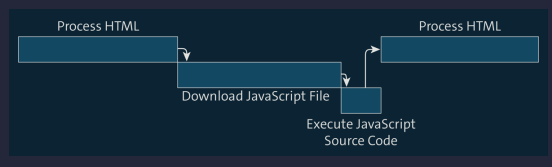

<h1>Getting Started</h1>

- [The Relationship among HTML, CSS, and JavaScript](#the-relationship-among-html-css-and-javascript)
- [The Right Tool for Development](#the-right-tool-for-development)
  - [Editors](#editors)
  - [Development Environments](#development-environments)
- [Integrating JavaScript into a Web Page](#integrating-javascript-into-a-web-page)
  - [Preparing a Suitable Folder Structure](#preparing-a-suitable-folder-structure)
  - [Creating a JavaScript File](#creating-a-javascript-file)
  - [Embedding a JavaScript File in an HTML File](#embedding-a-javascript-file-in-an-html-file)
  - [Defining JavaScript Directly within the HTML](#defining-javascript-directly-within-the-html)
  - [Placement and Execution of the `<script>` Elements](#placement-and-execution-of-the-script-elements)
  - [Displaying the Source Code](#displaying-the-source-code)
  - [Showing the Standard Dialog Window](#showing-the-standard-dialog-window)
  - [Writing to the Console](#writing-to-the-console)
- [Using Existing UI Components](#using-existing-ui-components)

## The Relationship among HTML, CSS, and JavaScript

In HTML, you use HTML elements to specify the structure of a web page and the meaning (semantics) of individual components on a web page. CSS, on the other hand, uses special CSS rules to determine how the individual components that you have previously defined in HTML should be displayed; this is used to define the design and layout of a web page. Last but not least, JavaScript is used to add dynamic behavior to the web page (or to the components on a web page) or to provide more interactivity on the web page. Thus, in the vast majority of cases, a web page consists of a combination of HTML, CSS, and JavaScript code. Note that though we just said that JavaScript takes care of the behavior of a web page, you can create functional web pages entirely without JavaScript. In principle, you can also create web pages without CSS; it is possible. In that case, only the HTML is evaluated by the browser. That means, however, that the web page is less fancy (without CSS) and less interactive and user-friendly (without JavaScript)


It is considered good development style not to mix the individual layers—that is, to keep HTML, CSS, and JavaScript code independent of each other and in separate files. This makes it easier to keep track of a web project and ultimately ensures that you can develop more effectively. In addition, this method enables you to include the same CSS and JavaScript files in various HTML files and thus to reuse the same CSS rules or JavaScript source code in several HTML files. When developing professional websites, there are several stages preceding the development step. Before development even begins, prototypes are designed in concept and design phases (either digitally or quite classically with pen and paper). By the way, HTML and CSS are not programming languages! HTML is a markup language and CSS is a style language; only JavaScript of the languages we’re discussing here is a programming language. The process of presenting a web page in the browser is called rendering. A common phrase among developers is "The browser renders a web page." This involves evaluating HTML, CSS, and JavaScript code, creating an appropriate model of the web page, and "drawing" the web page into the browser window.

## The Right Tool for Development

In principle, a simple text editor would be sufficient for creating JavaScript files (and for simple code examples this is perfectly fine), but sooner or later you should acquire a good editor that supports you when writing JavaScript and that is specifically designed for developing JavaScript programs

### Editors

There are a number of really good editors that can be used effectively. For example, [Sublime Text](https://www.sublimetext.com/) and [Atom](https://atom.io/), both available for Windows, macOS, and Linux, are popular editors in the developer community.

### Development Environments

Software developers switching from languages like Java or C++ to JavaScript are in most cases used to integrated development environments (IDEs), as known from their previous programming languages. In a way, you can think of a development environment as a very powerful editor that provides various additional features compared to a "normal" editor, such as synchronization with a source control system, running automatic builds, or integrating test frameworks. [WebStorm](https://www.jetbrains.com/webstorm/) is one example of a very popular and also very good development environment. Meanwhile a personal favorite among the development environments is [Visual Studio Code](https://code.visualstudio.com)

## Integrating JavaScript into a Web Page

Per tradition (like almost every book on programming languages), we will start with a very simple Hello World example, which only produces the output Hello World. This is not very exciting yet, but right now the point is to show you how to embed a JavaScript file in an HTML file in the first place and how to execute the source code contained in the JavaScript file. We will take care of more complex things later.

### Preparing a Suitable Folder Structure

This will be the directory structure for the example. The HTML file is at the top level because this is the entry point for the browser and thus the file you will invoke in the browser right away.

```zsh
.
├── index.html
├── scripts
│   └── main.js
└── styles
    └── main.css
```

It is a good idea to create different folders for the CSS and JavaScript files. The names styles (for CSS files) and scripts (for JavaScript files) are quite common. Especially if you are dealing with a lot of different JavaScript and CSS files during development, this separation (or an arrangement with subfolders in general) makes it easier to keep track of your project.

### Creating a JavaScript File

As mentioned earlier, it’s better to save JavaScript code in a separate file (or in several separate files) that can then be embedded in the HTML code. So the first thing you need is a JavaScript file. Simply open the editor of your choice (or if you didn't take my advice, the development environment of your choice), create a new file, enter the lines of source code

```javascript
function showMessage() {
  alert("Hello World!");
}
```

JavaScript files have the extension .js. Other file extensions are also possible, but the .js extension has the advantage that editors, development environments, and browsers directly know what the content is about. You should therefore always save all JavaScript files with the .js extension. (By the way, browsers recognize JavaScript files delivered by a web server via the Content-Type header, a piece of information that comes with the file from the server.) The code defines a function with the name `showMessage`, which in turn calls another function (with the name `alert`) and passes it the message `Hello World`. The alert function is a JavaScript standard function

### Embedding a JavaScript File in an HTML File

To use the JavaScript source code within a web page, you need to link the JavaScript file to the web page or embed the JavaScript file in the HTML file. This is done via the HTML element named `<script>`. This element can be used in two different ways: On the one hand, as we will demonstrate subsequently, external JavaScript files can be included in the HTML. On the other hand, JavaScript source code can be written directly between the opening `<script>` tag and the closing `</script>` tag. The `<script>` element has a total of six attributes, out of which the `src` attribute is certainly the most important one: it’s used to specify the path to the JavaScript file that is to be included.

| Attribute  | Meaning                                                                                                                                                                                                                                                                                                                                                                        | Comment  |
| ---------- | ------------------------------------------------------------------------------------------------------------------------------------------------------------------------------------------------------------------------------------------------------------------------------------------------------------------------------------------------------------------------------ | -------- |
| `async`    | Specifies whether the linked JavaScript file should be downloaded in an asynchronous way in order not to interrupt the download of other files. This only makes sense in combination with the `src` attribute.                                                                                                                                                                 | Optional |
| `charset`  | Specifies the character set of the source code that is embedded via the `src` attribute. This only makes sense in combination with the `src` attribute, but is rarely used because most browsers do not respect this attribute. It is also considered better style to use UTF-8 everywhere within a website and define this in the `<meta>` element via the charset attribute. | Optional |
| `defer`    | Specifies whether to wait to execute the linked JavaScript file until the web page content has been completely processed. This only makes sense in combination with the `src` attribute, but is not always supported, especially not by older browsers.                                                                                                                        | Optional |
| `language` | Originally intended to indicate the version of JavaScript code used, but largely ignored by browsers.                                                                                                                                                                                                                                                                          | Outdated |
| `src`      | Specifies the path to the JavaScript file to be embedded.                                                                                                                                                                                                                                                                                                                      | Optional |
| `type`     | Used to specify the MIME type in order to identify the scripting language (in our case, JavaScript). However, you can also omit this attribute because `text/javascript` is used by default, which is supported by most browsers.                                                                                                                                              | Optional |

Now create an HTML file named `index.html` and insert the content shown

```html
<!DOCTYPE html>
<html lang="en">
  <head>
    <meta charset="UTF-8" />
    <title>Example</title>
    <link rel="stylesheet" href="styles/main.css" type="text/css" />
  </head>
  <body>
    <!--Here the JavaScript file will be included -->
    <script src="scripts/main.js"></script>
  </body>
</html>
```

If you now open this HTML file in the browser, nothing will happen yet because the function we defined is not yet called at any point. Therefore, add the `showMessage()` call at the end of the JavaScript file and reload the web page in the appropriate browser. Then a small hint dialog should open, containing the message Hello World and with a slightly different appearance depending on the browser

> Multipurpose Internet Mail Extension (MIME) types, also called internet media types or content types, were originally intended to distinguish between content types within emails containing different content (such as images, PDF files, etc.). Now, however, MIME types are not only used in the context of email, but also whenever data is transmitted over the internet. If a server sends a file with a special MIME type, the client (e.g., the browser) knows directly what type of data is being transmitted. For JavaScript, the MIME type wasn’t standardized for a long time, so there were several MIME types—for example, application/javascript, application/ecmascript, text/javascript and text/ecmascript. Since 2006, however, there is an [official standard](www.rfc-editor.org/rfc/rfc4329.txt) that defines the acceptable MIME types for JavaScript. According to this standard, text/javascript and text/ecmascript are both deprecated, and application/javascript and application/ecmascript should be used instead. Ironically, it’s safest not to specify any MIME type for JavaScript at all (in the `<script>` element) as the type attribute is ignored by most browsers anyway.

### Defining JavaScript Directly within the HTML

For the sake of completeness, we’ll also show how you can define JavaScript directly within an HTML file. While this is usually not advisable because it means mixing HTML and JavaScript code in one file, it won’t hurt to know that it still works.

```html
<!DOCTYPE html>
<html>
  <head lang="en">
    <meta charset="UTF-8" />
    <title>Example</title>
    <link rel="stylesheet" href="styles/main.css" type="text/css" />
  </head>
  <body>
    <script>
      function showMessage() {
        alert("Hello World");
      }
      showMessage();
    </script>
  </body>
</html>
```

Note that `<script>` elements that use the src attribute must not contain any source code between `<script>` and `</script>`. If there is any, this source code will be ignored. You can use the `<noscript>` element to define an HTML section that is displayed when JavaScript is not supported in the browser or has been disabled by the user. However, if JavaScript is supported or enabled, the content of the `<noscript>` element will not be shown.

```html
<noscript>
  JavaScript is not available or is disabled. <br />
  Please use a browser that supports JavaScript, or enable JavaScript in your
  browser.
</noscript>
```

### Placement and Execution of the `<script>` Elements

In the early days of web development, people thought that linked files such as CSS files and JavaScript files should be placed in a central location within the HTML code. While CSS files are still placed in the `<head>` area, JavaScript files should be included before the closing `</body>` tag instead. The reason is this: when the browser loads a web page, it loads not only the HTML code but also embedded files such as images, CSS files, and JavaScript files. Depending on processor performance and memory usage, modern browsers are capable of downloading several such files in parallel. However, when the browser encounters a `<script>` element, it immediately starts processing the corresponding source code and evaluating it using the JavaScript interpreter. To be able to do this, the corresponding JavaScript source code must first be downloaded entirely. While this is happening, the browser pauses downloading all other files and parsing the HTML code, which in turn leads to the user impression that it takes longer to build the web page.



In addition, you will often want to access HTML elements on a web page within the JavaScript source code. If the JavaScript code is executed before these HTML elements have been processed, you’ll encounter an access error


If you place the `<script>` element before the closing `</body>` tag, though, you are on the safe side in this regard, because in that case all elements included inside the `<body>` element are already loaded


Two attributes that can be used to influence the loading behavior of JavaScript are the `async` and `defer` attributes, which we already mentioned briefly. The former ensures that the processing of HTML code is not paused when the browser encounters a `<script>` element. The JavaScript file is downloaded asynchronously


The defer attribute takes this one step further. On the one hand, just like async, this attribute ensures that the HTML code processing is not paused. On the other hand, the JavaScript source code is executed only after the HTML code has been fully processed


The async attribute is only suitable for scripts that work completely independently and have nothing to do with the HTML on the web page. An example of this is the use of Google Analytics. The defer attribute, on the other hand, is currently not supported by all browsers, so you should also consider its use with caution.

### Displaying the Source Code

All browsers usually provide a way to view the source code of a web page. This can be helpful in many cases—for example, if you want to check how a particular feature is implemented on a website you have discovered. If you look at the source code of more complex web pages, it’s often very confusing. This is usually due to multiple reasons: on the one hand, content is often generated dynamically, and on the other, JavaScript is often deliberately compressed and obscured by web developers—the former to save space, the latter to protect the source code from prying eyes. If you display the source code of a web page (no matter in which browser), you are first presented with the corresponding HTML code of the web page. Conveniently, however, embedded files such as CSS files or JavaScript files are linked in this source code view so that you can easily get to the source code of the linked file as well

### Showing the Standard Dialog Window

In addition to the already known hint dialog displayed by calling the `alert()` function, the JavaScript language provides two more standard functions for displaying dialog boxes. The first one is the `confirm()` function. It’s used to display confirmation dialogs. In contrast to the hint dialog, the confirmation dialog contains two buttons: one to confirm and one to cancel the corresponding message. The second one is the `prompt()` function. This function opens an input dialog where users can enter text. In practice, however, these standard dialogs for hints, confirmation, and input are rarely used because they offer limited options for statements and—as already shown for the hint dialog—their design relies on the layout of the browser being used, which usually does not match the layout of the web page.

### Writing to the Console

When developing JavaScript applications, you’ll often want to generate output for yourself for testing purposes only. For such test-only output, it obviously doesn't make sense to present it in dialogs that users would get to see as well. For this reason, all current browsers now offer a console, which is suitable for exactly such purposes and which you can access within a JavaScript program in order to output messages. By default, this console is hidden because users of a web page usually can do little with it. For writing to the console, browsers provide the console object. This is a JavaScript object first introduced by the Firefox plug-in named [Firebug](https://getfirebug.com) and it provides various ways to generate output to the console. Firebug itself has been discontinued, but the console object (although still not included in the ECMAScript standard) is available in almost every JavaScript runtime environment. A generally supported method is the `log()` method, which can be used to generate simple console output. In addition to the `log()` method, console provides several other methods.

| Method    | Description                                                                                                                                                      |
| --------- | ---------------------------------------------------------------------------------------------------------------------------------------------------------------- |
| `clear()` | Clears the console.                                                                                                                                              |
| `debug()` | Used to output a message intended for debugging (or troubleshooting). (You may first need to set the appropriate developer tools to return this type of output.) |
| `error()` | Used to output an error message. Some browsers display an error icon next to the output message within the console.                                              |
| `info()`  | This will display an info message in the console. Some browsers—Chrome, for example—also output an info icon.                                                    |
| `log()`   | Probably the most commonly used method of console. Generates normal output to the console.                                                                       |
| `trace()` | Outputs the stack trace—that is, the method call stack                                                                                                           |
| `warn()`  | Used to issue a warning to the console. Again, most browsers will display a corresponding icon next to the message.                                              |

## Using Existing UI Components

Because the use of `alert()`, `confirm()`, and `prompt()` is rather outdated and only useful for quick testing, and the output via the console object is reserved for developers anyway, you obviously still need a way to create an appealing output for the user of a web page. To this end, you can write the output of a program into existing UI components such as text fields and the like. When developing for the web with JavaScript, it's relatively common to use HTML components for sending output from a program to the user.
