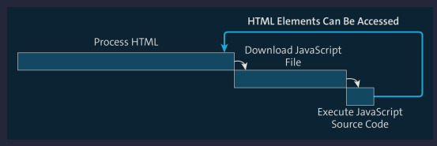
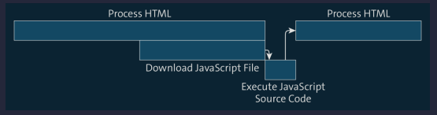

<h1>Basics and Introduction</h1>

- [Communicating with the Computer](#communicating-with-the-computer)
- [Programming Languages](#programming-languages)
- [Compiled Programming Languages](#compiled-programming-languages)
- [Interpreted Programming Languages](#interpreted-programming-languages)
- [Intermediate Languages](#intermediate-languages)
- [Overview of Different Programming Languages](#overview-of-different-programming-languages)
- [Tools for Program Design](#tools-for-program-design)
  - [Flowcharts](#flowcharts)
    - [Elements in a flowchart](#elements-in-a-flowchart)
  - [Pseudocode](#pseudocode)
- [History of JavaScript](#history-of-javascript)
- [Frontend of Web Applications](#frontend-of-web-applications)
- [Web Application Backend](#web-application-backend)
- [Mobile Applications](#mobile-applications)
- [Desktop Applications](#desktop-applications)
- [Embedded Systems](#embedded-systems)
- [Summary](#summary)

## Communicating with the Computer

Programming is about letting a computer take over certain tasks. Simply put, the task of a developer is to give instructions to the computer so that it is able to perform the tasks assigned to it. In other words, as a developer, you formulate individual steps or solving a specific problem, such as sorting data in a table or validating form data entered on a web page. The steps are then evaluated one by one by the computer. In summary, the steps for solving a problem in computer science and software development are generally referred to as algorithms. Therefore, a program (also called software or an application) is a sequence of algorithms and, as such, a sequence of instructions that can be executed by the computer.

## Programming Languages

Deep down, computers work with zeros and ones; that much is common knowledge. A more professional term for "zeros and ones" is binary code or machine code or machine language. The background for this binary code is the technical level that only knows two states: zero for "power off" and one for "power on". Because it would be incredibly complicated (and disproportionately time-consuming) for developers like us to phrase the instructions for the computer in zeros and ones, clever people at some point invented programming languages that abstract and simplify this interaction with the computer. Programming languages can be further classified into different categories depending on their degree of abstraction. JavaScript is one of the so-called high-level programming languages, so it abstracts relatively far from the zeros and ones. Assembly languages, on the other hand, are much less abstract. They don’t require you to work with zeros and ones either, but the commands used are nevertheless relatively cryptic, and programming is comparatively complex.


Basically, there are two different ways to achieve this: via compilers or via interpreters. Depending on whether a programming language uses a compiler or an interpreter, it is a compiled programming language, an interpreted programming language or a so-called intermediate language.

## Compiled Programming Languages

n the case of compiled programming languages, a compiler converts the source code into machine code or into an executable machine code file. This happens by translating the instructions written in the source code into a sequence of instructions for the computer.


Despite all the effort required, compiled programs still have a crucial advantage that we mentioned in passing: the machine code generated in each case can be executed on the respective operating system without auxiliary tools. Thus, no other programs need to be installed on the operating system to run a program compiled into machine code.

## Interpreted Programming Languages

With interpreted programming languages, it isn’t necessary to compile the source code. The source code is not translated by a compiler but evaluated by an interpreter. Such an interpreter must be installed on the computer (or on the corresponding operating system) on which the program is to be executed (in contrast to the compiler, which only needs to be installed on the computer on which the corresponding source code is compiled).


Interpreted programming languages thus require an interpreter to execute a program. Often this is a component of a so-called runtime environment (RTE). RTEs are used to enable application programs to run on a given operating system. In addition to an interpreter, RTEs also provide basic functions such as reading and writing files and access to peripheral devices. One RTE that has become very popular in recent years is Node.js. Other JavaScript interpreters, which are very lightweight in terms of size (and therefore require little disk space), are also suitable for running JavaScript on microcontrollers.



Both the compiler and the interpreter approach have advantages, but also disadvantages.

| Compiler                                                                                                | Interpreter                                                                                                                                                                                                                                                                                                             |
| ------------------------------------------------------------------------------------------------------- | ----------------------------------------------------------------------------------------------------------------------------------------------------------------------------------------------------------------------------------------------------------------------------------------------------------------------- |
| The program must be recompiled for execution every time.                                                | The program can be executed directly.                                                                                                                                                                                                                                                                                   |
| Usually delivers very good performance because the source code doesn’t have to be converted at runtime. | Tends to be less efficient than compiled programs as source code conversion occurs at program runtime. Nowadays, so-called just-in-time (JIT) compilers are often used in this context. They convert the source code or frequently executed source code into machine code that can then be executed relatively quickly. |
| Due to the additional compilation step, syntax errors are detected faster.                              | Because syntax errors are only detected at runtime, they can easily be overlooked.                                                                                                                                                                                                                                      |

## Intermediate Languages

There are some programming languages that cannot be clearly assigned to one of the two categories mentioned (compiled and interpreted) as they use both compilers and interpreters. In Java, for example, the source code is compiled by a compiler into so-called bytecode, a kind of intermediate code, which in turn requires an interpreter in order to be executed



The advantage of this approach is that Java applications do not have to be compiled on the same operating system on which they will later be executed (in contrast to compiled languages) as the bytecode is independent of the operating system. The only thing that needs to be present on the respective target operating system is an interpreter for the bytecode—in other words, a runtime environment for Java

## Overview of Different Programming Languages

| Programming Language | Type                  |
| -------------------- | --------------------- |
| Ada                  | Compiled              |
| BASIC                | Interpreted           |
| C                    | Compiled              |
| C++                  | Compiled              |
| C#                   | Compiled              |
| COBOL                | Compiled              |
| Fortran              | Compiled              |
| Go                   | Compiled              |
| Java                 | Intermediate language |
| JavaScript           | Interpreted           |
| Lisp                 | Intermediate language |
| Objective-C          | Compiled              |
| Perl                 | Interpreted           |
| PHP                  | Interpreted           |
| Python               | Interpreted           |
| Ruby                 | Interpreted           |
| Rust                 | Compiled              |
| Swift                | Compiled              |
| Visual Basic         | Compiled              |

## Tools for Program Design

As a developer, you’re often itching to start with the implementation of an algorithm—but you should avoid being too hasty in the process. It’s better to think about the structure of the algorithm first. It’s best to initially follow these steps when implementing an algorithm:

1. **Set the goal of the algorithm**
   What do you want to achieve with the algorithm? What problem do you want the computer to solve for you? Is there something be calculated? Is there data to be sorted or user input to be checked?
2. **Define the steps**
   Break down the problem into individual steps. In what order do these steps have to be performed? How are the steps related? Do individual steps need to be performed repeatedly? Or under certain conditions only?
3. **Write the algorithm**
   For the computer to understand your algorithm, you need to write it in a programming language.

In the context of programming and software development, implementation means the realization of an algorithm (or more generally, a program flow) in a specific programming language.

### Flowcharts

Flowcharts, also called program flowcharts, are graphical representations for describing algorithms that allow you to precisely define individual steps and the overall flow. Flowcharts can be enormously helpful in getting a clear idea of what an algorithm is supposed to do. Flowcharts essentially consist of boxes in different shapes connected by lines.


This flowchart illustrates the flow of a program for the login process on a website. If a valid combination of username and password is entered, the user profile is to be loaded and redirected to the welcome page. If the input is incorrect, and if the maximum number of failed login attempts has not yet been exceeded, an error message is to be displayed and the user should be redirected back to the login page. If, on the other hand, the maximum number of failed login attempts has been exceeded, then the user should be blocked and a notification email should be sent to the responsible administrator.

#### Elements in a flowchart

- Start/stop control points are used to describe the beginning and the end of an algorithm. They are represented in flowcharts as rounded rectangles. They usually contain labels such as "Start," "Begin," "Stop," or "End" or more detailed wording that also includes the name of the algorithm, such as in the example "Start login," "Login failed," or "Login completed successfully."
- Individual statements or operations of an algorithm are represented in a flowchart by normal rectangles. As a label, they contain a short, meaningful description of what is to be done in each step—for example, "Create user session."
- The input and output of the program are represented by parallelograms. They are also labeled with a short description of what kind of input is expected by the program (e.g., "Input username and password") or what kind of output will be generated (e.g., "Show error message" or "Show welcome page").
- If a decision has to be made at a certain point within an algorithm about which of the following instructions is to be executed, this is described in flowcharts using decision points, graphically represented as square diamonds with two paths leading away from each. As a rule, they are labeled with questions that can be answered with yes or no or with questions that can be answered with one of two possible answers. This is because a decision point is used to follow one path or the other in the flowchart, depending on the particular answer. The answers are written on the corresponding lines leading from the decision point. One of the decision points in the example is used to check whether the credentials entered are valid. If this is true (i.e., if the question "Access data valid?" is answered with "Yes"), the path shown on the right-hand side of the chart is the one to be followed. If not, the path shown on the left-hand side is to be followed.
- Rectangles with two lines on the left and right sides are used to define calls to subroutines (or subalgorithms), which again consist of various steps. In the example flowchart, they describe the subroutines of locking the user and sending the notification email to the administrator.

| Element                 | Label                 | Description                                                                                      |
| ----------------------- | --------------------- | ------------------------------------------------------------------------------------------------ |
|   | Start/stop checkpoint | Used to describe the beginning and the end of an algorithm                                       |
|    | Operation             | Used to describe individual statements or operations of an algorithm                             |
|          | Input and output      | Used to describe input or output                                                                 |
|   | Decision point        | Used to describe branches in the algorithm                                                       |
|  | Execute a subroutine  | Used to describe calls to subroutines                                                            |
|  | Connection            | Used to connect individual elements in the flowchart and thus describe the flow of the algorithm |

### Pseudocode

As an alternative (or supplement) to flowcharts, you can also create so-called pseudocode for program design. This means that you write the individual steps of an algorithm in more or less natural language instead of in a concrete programming language.

```{r, tidy=FALSE, eval=FALSE, highlight=FALSE }
program start login
  read username and password
  if user data valid then
    create user session
    show welcome page
  else
    if maximum number of login attempts reached then
      call subroutine to lock user
      call subroutine to send email to administrator
      display error message
      exit program
    else
      display error message
      redirect to input
      go to user data input
program end login
```

Unlike flowcharts, where the elements used are predetermined, pseudocode has no restrictions in this regard. As a rule, you use words and sentence components such as "read", "if ... then ... else", "show", "output", "as long as ... execute", and the like. An essential feature of pseudocode (which also shows the similarity to real source code) are the indentations at the beginning of lines.

| Pseudocode                                                    | Element from Flowchart |
| ------------------------------------------------------------- | ---------------------- |
| program start program end                                     | Start/stop checkpoint  |
| Active sentences, starting with verbs like create, show, etc. | Operation              |
| read, output                                                  | nput and output        |
| if ... else                                                   | Decision point         |
| as long as ... execute                                        | Repetitions            |
| subroutine call                                               | Execute a subroutine   |

The advantage of pseudocode, as with flowcharts, is that you can think about the flow of an algorithm in advance without having to start directly with the implementation in your chosen programming language.

## History of JavaScript

Like software programs, programming languages are also updated from time to time. In that case, new features are added to the programming language to make the developer's work easier, while other features that caused problems in the past or were simply rarely used are dropped. So there were different versions of JavaScript in the past as well. The history of JavaScript begins in 1995, when Brendan Eich designed the language for Netscape Navigator in a record time of two weeks. In the beginning, JavaScript did not have its current name; it was initially called Mocha and LiveScript. Due to a cooperation between Netscape and Sun (the company behind the Java programming language) and for marketing reasons (the Java programming language was already quite popular at the time) the language was finally renamed to JavaScript. However, the similarity of the name to Java should not lead you to jump to conclusions: apart from the similar name, the two languages have little in common. Shortly after the release of JavaScript, Microsoft followed up with a more or less compatible language (JScript) for Internet Explorer 3.0. To reconcile these two similar languages, Netscape then submitted JavaScript to the European Computer Manufacturers Association (ECMA), with the goal of creating a unified standard for the language. This standard has since been running under the name ECMAScript, which was adopted in version 6 in 2015 (ES6 or ES2015 for short). Since then, new features have been added to the standard every year, so it was agreed not to use a separate consecutive version number, but to simply list the respective calendar year in the version number

| Version Name | Year of Publication |
| ------------ | ------------------- |
| ES1          | 1997                |
| ES2          | 1998                |
| ES3          | 1999                |
| ES4          | Not released        |
| ES5          | 2009                |
| ES6/ES2015   | 2015                |
| ES2016       | 2016                |
| ES2017       | 2017                |
| ES2018       | 2018                |
| ES2019       | 2019                |
| ES2020       | 2020                |
| ES2021       | 2021                |

## Frontend of Web Applications

When developing websites and web applications, a distinction is generally made between the part that takes place on the client side in the browser (the so-called frontend) and the part that takes place on the server side (the so-called backend). JavaScript has its roots in frontend development, and for a long time it was mainly used to "spruce up" the interface of a web page with dynamic effects.


A related term coined back in the 1990s is Dynamic HTML (DHTML), which is the dynamic modification of HTML code using JavaScript. DHTML has been forgotten these days because, from today's point of view, it was based on rather ugly JavaScript code and was characterized more by bad practices than by best practices. We will not deal with DHTML at all but with DOM scripting, which is another way of dynamically modifying the HTML of a web page. DOM stands for Document Object Model and refers to the object model behind web pages. An important milestone for JavaScript and the basis for more complex web applications was the introduction of the XMLHttpRequest object and the associated Ajax (Asynchronous JavaScript and XML), respectively, which allowed asynchronous requests to be sent from the browser to a server for the first time. Although HTML—the HyperText Markup Language, for describing web documents—has made a big leap with the version change from HTML 4.01 to HTML5 and many form entries can now also be checked directly via HTML without using JavaScript, JavaScript is still a lot more flexible. If you know a bit about HTML, you'll know that HTML comprises a number of basic components for defining the user interface (UI), including text fields, radio buttons, check boxes, tables, lists, and more. However, HTML does not provide complex interface elements or UI components, including tabs, expandable and collapsible areas (accordions), customizable dialogs, and so on. Again, you have to resort to JavaScript instead.

## Web Application Backend

Even if you don't notice it directly when interacting with a web application, a large part of the application logic takes place on the server side—that is, in the backend—especially in complex applications. Imagine a simple search function for a website: after you have entered the search criteria into the search form and the search form has been submitted, and before the search results are displayed, the essential part—namely, the search itself—takes place on the server. This, too, needs to be programmed. Databases may need to be queried, the results put into a specific format, and more. Until a few years ago, JavaScript could not be used for this purpose, or a considerable detour had to be taken. The server side was reserved for languages like Java or PHP. But the introduction of Node.js in particular, a runtime environment that can run JavaScript on the command line (and thus also on the server side), led to a continuing boom in server-side JavaScript applications.


## Mobile Applications

Mobile applications have become almost more important than web applications in recent years. Essentially, they can be divided into three categories:

- **Native applications**: Native applications are those applications that have been developed for a specific (mobile) operating system, such as iOS, Android, or Windows Mobile. Native applications are compiled for a specific operating system: applications for iOS are programmed in Objective-C (or more recently in Swift), applications for Android in Java, and applications for Windows Mobile in C#, for example. Native applications tend to perform better than non-native applications. Native applications also offer more options to access certain features of a given mobile device.
- **HTML5 applications**: HTML5 applications are developed using only standard HTML5, CSS3 (Cascading Style Sheets), and JavaScript technologies. The advantage is that because such applications do not need to be compiled, they do not depend on the operating system used (provided that a browser is installed). This means that one and the same HTML5 application can run on iOS and on Android and on Windows Mobile. But HTML5 applications usually do not offer the same performance as native applications. In addition, they cannot access the full functionality of a given mobile device.
- **Hybrid applications**: Hybrid applications are a combination of native and HTML5 applications. They are developed entirely in HTML5, CSS3, and JavaScript, but run in a special native container, which also enables them to access mobile device functionality hidden from HTML5-only apps, just like native apps.

## Desktop Applications

In combination with HTML5 and CSS3, JavaScript is now used not only in the browser, but also in desktop applications. For example, since Windows 8, it has been possible to create native applications entirely in these technologies. The [NW.js](http://nwjs.io) and [Electron](https://www.electronjs.org) frameworks make it possible to develop operating system-independent desktop applications for Linux, Windows, and Mac.

## Embedded Systems

You have probably heard the term Internet of Things (IoT; also called Web of Things). It refers to the networking of everyday objects (things) via the internet. IoT also includes wearables—that is, portable microcomputers that are worn (invisibly) in articles of clothing or (visibly) directly on the body in the form of devices like, for example, smartwatches. Many of these devices are already programmable out of the box using JavaScript: for example, the [Bangle.js smartwatch](https://banglejs.com/) can be programmed via JavaScript, as can the Philips Hue smart LED lights. Examples of programmable microcontrollers include [Tessel](https://tessel.hackster.io/) and [Espruino](https://www.espruino.com/). With the [Johnny Five library](https://github.com/rwaldron/johnny-five), Arduino microcomputers can also be controlled remotely.

## Summary

- Flowcharts are used to graphically illustrate the flow of algorithms or programs.
- Pseudocode is used to describe the flow of algorithms or programs in a text form.
- JavaScript is not a compiled programming language, but an interpreted programming language.
- JavaScript lets you program both the frontend and the backend of a web application.
- In addition, JavaScript enables you to develop mobile applications, desktop applications, embedded applications, and games and 3D applications.
